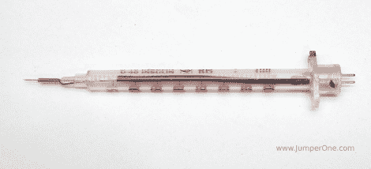

# 忘记治疗你的糖尿病——用你的胰岛素注射器作为逻辑探针

> 原文：<https://hackaday.com/2012/08/29/forget-treating-your-diabetes-use-your-insulin-syringe-as-a-logic-probe/>

Hackaday reader [JumperOne]需要一个逻辑探针，可以用来可靠地测试一些微小的. 5 毫米间距的 ic 引脚。他的示波器附带的探针有点太大，不够锋利，无法完成这项工作，但他认为注射器可能会很好地完成这项工作。

他在注射器的商业端附近钻了一个小洞，通过这个洞他放入了一段剥开的双绞线。[JumperOne]然后将一对引脚焊接到一小段同轴电缆上，将另一端连接到注射器中已经存在的双绞线上。在小心翼翼地将细电缆绕在针上之后，他用一点热胶水将同轴电缆和它的针固定住。

[JumperOne]说他的临时逻辑探针工作得非常好，锋利的针可以很容易地穿透任何阻挡它的氧化层或阻焊层。使用注射器作为探针的一个额外好处是，它们配有盖子，有助于保护这种精密工具的两端。