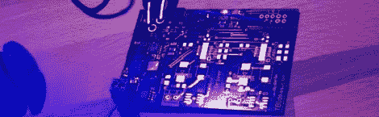

# 为高功率发光二极管建立一个驱动器

> 原文：<https://hackaday.com/2012/08/30/building-a-driver-for-absurdly-high-power-leds/>

几年前，你能买到的最高功率的 led 灯的上限大约是 3 瓦。现在，LED 制造商正在用 30、40 甚至 90 瓦的 LED 来达到荒谬的额定功率。获得这些高功率发光二极管不再是一个问题，但为它们供电肯定是一个问题。[Thomas] [制造了一个 LED 驱动器](http://www.tbideas.com/blog/design-of-the-led-driver/)能够为这些巨大的 LED 供电，并创造出一个可能足以对眼睛造成伤害的灯光表演。

【托马斯】LED 驱动基于线性科技的 [LT3518 LED 驱动](http://www.linear.com/product/LT3518)。该驱动器是构建大型 WiFi 控制 RGB led 项目的一部分，因此该驱动器具有三个独立 LED 的输出，每个 LED 能够提供 700 mA 的电流。

因为[托马斯]正在处理点亮这些巨大的 LED 所需的疯狂的热量和功率，所以驱动板在每个 LED 驱动器旁边都有一个温度传感器。当电路板过热时，驱动器会自动关闭，防止*坏事*发生。

你可以在他的 WiFi LED 项目的[构建页面上查看一些【Thomas】LED 驱动程序的图片。一个真正可怕的照明功率量在这里，这也使得它不可能得到一个良好的董事会运作的照片。](http://www.tbideas.com/blog/some-pictures-of-our-latest-prototype/)