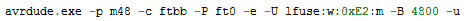

# AVR 熔丝位解释

> 原文：<https://hackaday.com/2012/08/30/avr-fuse-bits-explained/>

从恒温器中的 ATtiny 到 Arduino 中的 ATMega，每个 AVR 微控制器都将其配置存储在一系列熔丝位中。这些熔丝位控制设置，例如内部振荡器的乘法器(从而控制芯片的速度)，或者 reset 引脚是否可以用作 GPIO 引脚。[YS]刚刚发布了一个很棒的教程来理解这些保险丝/锁位，当你发现你的 AVR 比你想要的慢 8 倍时，这只是你需要的参考指南。

例如，[YS]使用 ATMega48 默认设置。出厂时，Mega48 的保险丝位设置为使用 8MHz 内部 RC 振荡器，CKDIV8 位设置。这导致芯片以 1 兆赫兹的速度运行，对于[YS]来说有点慢。

通过查看 ATMega48 的数据表，[YS]发现 CKDIV8 保险丝是低保险丝字节的第 7 位。出厂时，该字节的默认值为 0b01100010。要删除“8 分频时钟”位，[YS]需要将低位字节更改为 0b11100010 或 0xE2。这是通过 [AVRdude](http://www.nongnu.org/avrdude/) 将 lfuse:w:0xE2:m 附加到编程时输入的命令上来实现的。

熔丝位不需要吓人。只要你能在二进制和十六进制之间转换，能记住一个字节有 7 位(记得从 0 开始计数)，并能使用[一个易于使用的保险丝计算器](http://www.engbedded.com/fusecalc/)，就有可能改变你手头上任何 AVR 的所有设置。