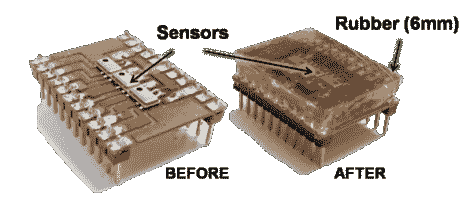

# 用数字气压计芯片构建触摸传感器

> 原文：<https://hackaday.com/2012/08/30/building-touch-sensors-from-digital-barometer-chips/>

几名哈佛研究人员开发了一种使用数字气压计作为触摸传感器的方法。对我们来说，好消息是他们已经开源了这个项目，包括 Eagle board 文件、固件和他们所用材料的细节。

选择数字气压计是因为它们的特点、可用性和低成本。该传感器使用一系列飞思卡尔 MPL115A2 芯片，这是一种专为高度计设计的 MEMS 气压计。大规模生产使它们变得便宜(在撰写本文时，Octopart 发现一些单个数量的价格为 1.71 美元)。芯片被焊接到一块电路板上，然后用橡胶浇铸而成。这样可以在保护传感器的同时分散压力。休息后的视频显示，他们顶住了橡胶锤的打击，支撑着 25 磅的重量。

读取数组有一些技巧。首先，这些设备被设计成一个项目一个项目地使用，因此它们有一个固定的 i2 地址。必须使用单独的芯片来单独寻址它们。但是一旦它启动并运行，你应该可以用它作为你正在建造的机器人手臂的指尖的反馈。

[https://www.youtube.com/embed/0EMi_pcG9rE?version=3&rel=1&showsearch=0&showinfo=1&iv_load_policy=1&fs=1&hl=en-US&autohide=2&wmode=transparent](https://www.youtube.com/embed/0EMi_pcG9rE?version=3&rel=1&showsearch=0&showinfo=1&iv_load_policy=1&fs=1&hl=en-US&autohide=2&wmode=transparent)

[via [Engadget](http://www.engadget.com/2012/08/04/takktile-turns-digital-barometers-into-open-source-robot-touch-s/)