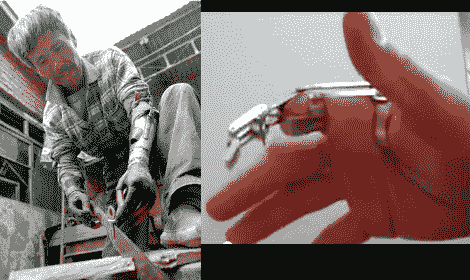

# 取代黑客传统中的手指或手臂

> 原文：<https://hackaday.com/2012/08/31/replacing-a-finger-or-an-arm-in-the-hacker-tradition/>

就在几周前，我们还在想，如果我们失去了一条腿，我们会不会试着自己造一个假肢。这对黑客响亮地回答了这个问题“是的！”。

右边的[是替换的指针指](http://www.youtube.com/watch?v=URBQV1O9XFI)。缺失的手指带走了前两个指关节，但还有足够多的手指可以轻松地与这个创作进行交互。这是一个机械上巧妙的装配，可以像你所期望的那样移动。休息之后自己看吧。似乎制造商打算在结构周围模制硅胶，但从未有时间发布更新视频。

左边是一名中国男子，他在钓鱼时失去了双臂。看起来他们使用的是自制炸弹而不是网，其中一枚过早爆炸。从那以后，他制造了几种不同的假肢，每一种都有自己的特殊用途。这个有一把锯子连接着它[，但是这两个](http://dvice.com/archives/2012/08/man-builds-hims.php)写在这个男人身上的[展示了他使用叉子和挥舞锤子的图像。](http://boingboing.net/2012/08/17/man-in-rural-china-loses-arms.html)

[https://www.youtube.com/embed/URBQV1O9XFI?version=3&rel=1&showsearch=0&showinfo=1&iv_load_policy=1&fs=1&hl=en-US&autohide=2&wmode=transparent](https://www.youtube.com/embed/URBQV1O9XFI?version=3&rel=1&showsearch=0&showinfo=1&iv_load_policy=1&fs=1&hl=en-US&autohide=2&wmode=transparent)