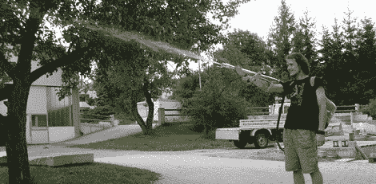

# 劳动节周末水枪表演

> 原文：<https://hackaday.com/2012/09/02/labor-day-weekend-water-gun-spectacular/>

在美国，夏天有两个假期。五月下旬，阵亡将士纪念日传统上标志着夏季的开始，公共游泳池的开放，以及数十名任性的青少年涌入商场的日子。九月初，劳动节标志着夏季的传统结束，这是一个烧烤的好周末，最后，也是邻居家的孩子在外面尖叫的结束。作为劳动节的周末，我们非常高兴地看到两个版本出现在 tip jar 中，这两个版本是关于定义夏天的一个对象:水枪。

#### 自制超级透雨器

[迈克尔]有一个天才的想法，用隔膜膨胀箱制造一把水枪(德语，这里是[可怕的翻译](http://translate.google.com/translate?sl=de&tl=en&js=n&prev=_t&hl=en&ie=UTF-8&layout=2&eotf=1&u=http%3A%2F%2Fregendrogenbogen.wordpress.com%2F&act=url))。这些水箱通常连接到热水器附近的热水管道上，允许热水膨胀，并保护管道免受过大压力。这是通过一个橡胶膜将水箱内部分成两半来实现的。罐的一半装满水，而另一半装满来自自行车打气筒的压缩空气。

[迈克尔]连接一根软管，用铝管做了一把漂亮的枪，来建造他的“枪”部分。在膨胀箱中 9 巴的压力下，[迈克尔]可以将水流射出 20 米。

### 带激光瞄准器的水枪炮塔

[这个造型](http://www.doityourselfgadgets.com/2012/08/remote-controlled-water-gun.html)来自【瓦伦丁】。他花了几欧元买了一个汽车水泵，并把它安装在一个 1 升的装满水的瓶子上。一个平移/倾斜炮塔是由数控铣削铝和一对伺服系统构成的。

在[瓦伦丁]解决了水射炮塔部分后，他在云台上安装了一个 2.4 GHz 的无线摄像头，并在他的遥控器后面绑了一个接收器。

增加一个小的液晶显示屏来显示炮塔的角度，这是一个非常酷的建筑，非常适合那些烦人的邻居小孩。

视频[瓦伦丁]的建设后，休息。

[https://www.youtube.com/embed/K4S0BELUJF4?version=3&rel=1&showsearch=0&showinfo=1&iv_load_policy=1&fs=1&hl=en-US&autohide=2&wmode=transparent](https://www.youtube.com/embed/K4S0BELUJF4?version=3&rel=1&showsearch=0&showinfo=1&iv_load_policy=1&fs=1&hl=en-US&autohide=2&wmode=transparent)