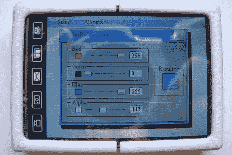

# 从零开始建设 PDA

> 原文：<https://hackaday.com/2012/09/02/building-a-pda-from-scratch/>

功能极其强大的 ARM 微控制器已经存在很长时间了，但直到最近它们才以几美元的价格和足够好的工具链用于一些严肃的开发工作。[Jose]想用他手头的 ARM 芯片开发一些令人敬畏的东西，所以[他建造了一个 PDA](http://www.todopic.com.ar/foros/index.php?topic=39080.0) (西班牙语，[翻译](http://translate.google.com/translate?sl=es&tl=en&js=n&prev=_t&hl=en&ie=UTF-8&layout=2&eotf=1&u=http%3A%2F%2Fwww.todopic.com.ar%2Fforos%2Findex.php%3Ftopic%3D39080.0&act=url))，可以用作游戏机、示波器、时钟或手表。基本上，它是一台便携式自制电脑，可以做任何事情。

硬件是围绕 170MHz 的 ARM Cortex M4 芯片构建的。PCB 上包括一个 SD 卡插槽、一个 JTAG 接口、一个 USB 端口(仅用于在这一点上给电池充电)和一个触摸屏 LCD 控制器。

在设计了 PCB 和外壳之后，[Jose]在互联网上寻找一个像样的 GUI 库，但没有太大的成功。他最终找到了 Gwen T1，这是一个轻量级的 GUI 编程库，可以很容易地移植到 Jose 的硬件上。

到目前为止，[Jose]已经在他的自制软件 PDA 上运行了一些 GUI 演示，但是还没有什么非常有用的东西。尽管如此，[何塞]能够在没有开发团队的情况下推出一款全功能的 ARM 平板电脑硬件，这一事实让我们喜笑颜开。我们迫不及待地想看到几年后当*每个人*都具备必备的硬件和软件知识时，自制 ARM 设备的状态。