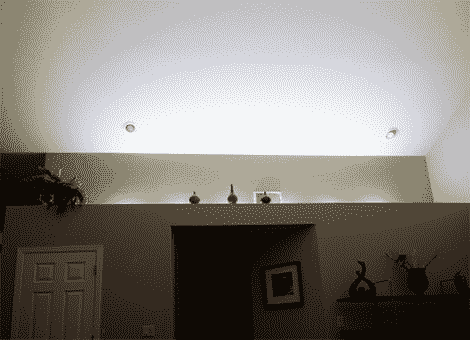

# 打造您自己的 LED 家居照明

> 原文：<https://hackaday.com/2012/09/03/building-your-own-led-based-home-lighting/>

我们看到 led 用于各种项目，但很少有人用它们从头开始建造家庭照明系统。[保罗·奥利维拉]决定尝试一下这个想法，包括他自己制作的发光二极管的衰减电源。在这里，你可以看到全亮度安装，但他的控制器也提供了一个较低的设置。

我们看到[Sprite_TM]用[一个 RGB LED 灯条照亮了他的客厅](http://hackaday.com/2010/02/21/controllable-leds-spice-up-the-living-room/)。[Paulo]选择了单独的 LED 模块，颜色都一样。它们是 Cree XM-L 功率 led，因此需要考虑散热问题。所有六个都沿着铝带安装，铝带用作散热器。它们串联在一起，由一个旧的笔记本电源供电。PIC 12F683 通过 MOSFET 使用 PWM 来调暗字符串。

两个亮度级别的控制系统使用墙壁开关。打开时，led 会渐亮至最大亮度。如果您在它们完全打开之前关闭并重新打开开关，则变暗的设置会起作用。PSU 的电容使这个问题变得复杂，但是[Paulo]通过增加一个功率电阻解决了这个问题。