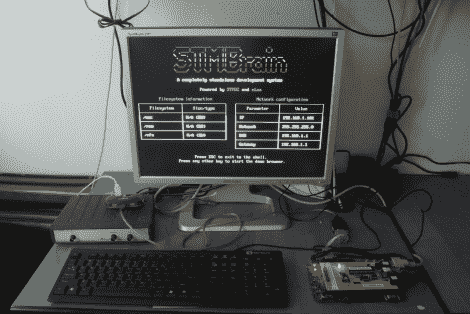

# STM32 处理器为这台电脑供电

> 原文：<https://hackaday.com/2012/09/03/an-stm32-processor-powers-this-pc/>

这台 32 位计算机是【波格丹一世·马里涅斯库】作为参赛作品建造的一个项目。遗憾的是，他没有获胜，但是他在记录构建方面做得非常出色。看过其他几个[自制 PC 项目](http://hackaday.com/2012/04/10/veronica-gets-vram-and-its-own-boot-logo/)后，我们对这类项目面临的挑战很熟悉，他为每个项目都找到了一些很好的解决方案。

他从一个 STM32F103ZET6 芯片开始。这是一款 ARM Cortex-M3 处理器，为游戏领域带来了巨大的动力。也就是说，产生 VGA 信号会大大削弱芯片对其他进程的用处，因此他将这项工作转移到一个单独的 Propeller 芯片上。一个 microSD 卡作为机器的存储器，运行 eLua ( [嵌入式 Lua 编程语言](http://www.eluaproject.net/overview))。有 1 MB 的外部 RAM 和一个用于键盘接口的 PS/2 端口。该系统通过 ENC28J60 以太网控制器联网。不要错过休息后的视频，在那里您可以看到系统上运行的几个演示。

[http://vimeo.com/28886601](http://vimeo.com/28886601)