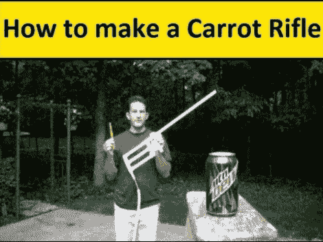

# 胡萝卜枪装了一拳；提高视力

> 原文：<https://hackaday.com/2012/09/04/carrot-gun-packs-a-punch-improves-eyesight/>

正好赶上你花园的胡萝卜收获季节[Lou]向我们展示如何制作胡萝卜发射步枪。它便宜、简单、快捷。如果你有 15 美元和 15 分钟，你可以有一个属于自己的。

加载方法非常简单。将一根胡萝卜尽可能地塞进嘴里，然后切掉多余的部分。最后，用推杆将胡萝卜头推进桶里。一旦你啃下剩下的胡萝卜块，并把压缩机软管连接到步枪上，你就准备好做一些破坏了。休息后的视频显示，一根胡萝卜穿过一个纸箱，穿透了一加仑的水。

[Lou]在项目中使用 CPVC。它只需要几根管子、管件、一个阀门和一个带螺纹的金属压缩机配件。把所有的东西粘在一起后，他把压缩机固定在适当的位置，然后走向靶场。

[https://www.youtube.com/embed/TFqTZj31__4?version=3&rel=1&showsearch=0&showinfo=1&iv_load_policy=1&fs=1&hl=en-US&autohide=2&wmode=transparent](https://www.youtube.com/embed/TFqTZj31__4?version=3&rel=1&showsearch=0&showinfo=1&iv_load_policy=1&fs=1&hl=en-US&autohide=2&wmode=transparent)