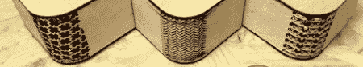

# 摆弄锯缝弯曲

> 原文：<https://hackaday.com/2012/09/04/playing-around-with-kerf-bending/>

随着激光切割机像杂草一样出现在黑客空间和制造商的工具棚中，难怪我们会看到制造技术的爆炸，如果没有激光切割机，这几乎是不可能的。其中一种技术是切缝弯曲，这是一种简单地通过沿着所需的弯曲方向燃烧图案来弯曲胶合板的方法。[Martin]刚刚发布了一个关于用激光切割机弯曲切口的很棒的教程，甚至想出了一些非常有趣的图案，可以用来制作自己的圆角外壳。

[马丁]的锯痕弯曲冒险始于他制作的一个小型无线电发射机盒。这个案例使用了非常常见的“垂直狭缝”方法，但是在这个案例的第一个版本中，狭缝被放置得相距太远。通过将切口移近，[马丁]得到了一个非常容易弯曲且非常坚固的木箱。

[马丁]还尝试了其他一些模式。为木箱制作的人字形图案几乎与传统的垂直开叉法一样可弯曲(并且更坚固)。从那里，[马丁]分支到更深奥的模式，如中世纪的十字架和空间入侵者模式，都是你的下一个高度风格化的围栏的理想选择。

最后，[Martin]说，只要设计不与弯曲成对角线，几乎任何图案都适用于切口弯曲。我们希望看到一些关于切口弯曲的适当工程分析，所以如果你能找出高强度、低机器时间弯曲的最佳模式，[在 tip line 上发送给](http://hackaday.com/contact-hack-a-day/)。