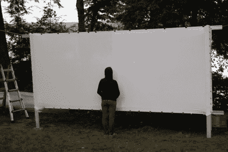

# 湖边小屋电影之夜

> 原文：<https://hackaday.com/2012/09/04/movie-night-at-the-lake-cabin/>

[安德鲁的]家庭有一个乡村湖边小屋。白天有很多事情要做，但是因为没有电，当太阳下山时，你的选择是有限的。当然有传统的营火，但是最近他们用户外电影观看来增加趣味。

为了让它运行起来，他们需要建造一个投影屏幕。他打算采用 2.35:1 的长宽比，但是如果你自己算一算，这种技术对任何方面都适用。他们有几个从旧粉笔板上挤出的铝槽，可以完美地作为框架的顶部和底部轨道。宽度设定为 14 英尺，他只需要将横梁安装在相距 5.95 英尺的立柱上。这提供了 183 英寸的观察表面。

白色的床单作为屏幕材料。在它被拉伸到位后，他们用[装订夹](http://en.wikipedia.org/wiki/Binder_clip)将它固定在轨道上。投影仪由两节 12V 电池通过一个 800W 逆变器供电。白天，电池由太阳能电池板系统充电。