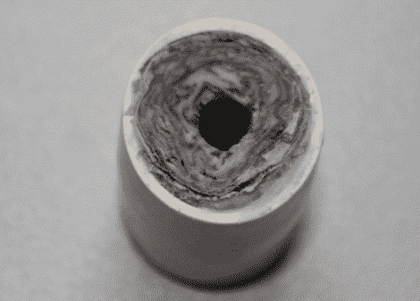

# 用旧报纸制造火箭推进剂

> 原文：<https://hackaday.com/2012/09/04/rocket-propellant-manufactured-from-old-newspaper/>

原来旧新闻纸可以有点爆炸性；至少当它与适当的成分结合时。Markus Bindhammer 发明了一种用报纸制造固体火箭推进剂的方法。从休息后的测试镜头来看，国产引擎工作得很好！

配料的清单并不长。除了报纸，你还需要一些氯酸钾(KClO3)作为氧化剂、白木胶和 PVC 管。KClO3 用研钵和杵研磨，然后在与木胶混合前通过筛子。这种组合被画在报纸上，然后用中间的玻璃棒卷起来。这是允许硬化之前，进入聚氯乙烯。多余的部分被修剪掉，整个蛋糕放在 105 摄氏度的对流烤箱中烘烤两个小时。

如果这一过程不适合你，也许烹饪一批糖基推进剂值得一试？

[https://www.youtube.com/embed/gZxRO6hVs_4?version=3&rel=1&showsearch=0&showinfo=1&iv_load_policy=1&fs=1&hl=en-US&autohide=2&wmode=transparent](https://www.youtube.com/embed/gZxRO6hVs_4?version=3&rel=1&showsearch=0&showinfo=1&iv_load_policy=1&fs=1&hl=en-US&autohide=2&wmode=transparent)