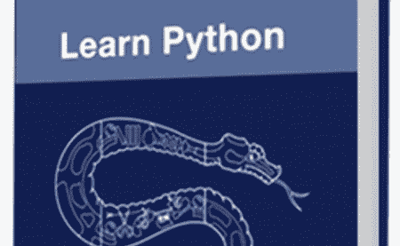

# 用于物理黑客的 Python 编程语言

> 原文：<https://hackaday.com/2012/09/05/the-python-programming-language-for-physical-hacking/>

我们总是在这里看到将计算与现实世界融合的项目。有些人天生在机械方面更强，而有些人在电子或编码方面更好。根据你的项目，这三个专业都是需要的。如果你的弱点在于让计算机为你服务，我可能会建议你学习 Python 语言。

我一直在经历[艰难地学习 Python](http://learnpythonthehardway.org/ "Learn Python the Hard Way")，这是网上免费提供的，或者你可以选择付费。到目前为止，我已经发表了我对[第 1-10 课](http://www.jcopro.net/2012/08/16/learn-python-the-hard-way-for-physical-computing-lessons-1-10/ "Learn Python the Hard Way lessons 1-10")和[第 11-20 课](http://www.jcopro.net/2012/09/01/learn-python-the-hard-way-for-physical-computing-lessons-11-20/ "Learn Python the Hard Way lessons 11-20")的看法。作为一名编程技能有限(但并非完全没有)的机械工程师，到目前为止这是一次极好的经历。

如果你想知道 Python 是否是一种学习的好语言，如果你想参与[HAD]风格的项目，为什么不看看下面的项目呢？

*   [光绘吧](http://hackaday.com/2012/07/24/simple-light-painting-bar-build/ "hackaday simple light painting build")用 Python 把一张图片翻译成 Arduino 代码。
*   [为操纵杆等输入设备](http://hackaday.com/2011/03/17/writing-python-drivers-for-input-devices/ "Writing Python Drivers for Input Devices")编写 Python 驱动程序。
*   [Splunk LED 仪表](http://hackaday.com/2012/03/02/simple-hardware-and-python-drive-this-splunk-led-meter/ "Splunk LED Meter")外部系统数据显示。

或者只做一个【HAD】的搜索，你会发现很多其他项目的灵感。如果你有一个 Python 项目要分享，一定要在评论中告诉我们！