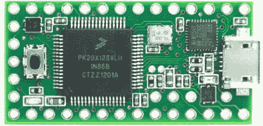

# 认识青少年 3.0

> 原文：<https://hackaday.com/2012/09/05/meet-the-teensy-3-0/>

 【保罗·斯托佛雷根】，这位广受欢迎且非常能干的兼容 Arduino 的 Teensy 开发板的幕后智囊，为 ARM 驱动的开发板[与 Teensy 3.0](http://www.kickstarter.com/projects/paulstoffregen/teensy-30-32-bit-arm-cortex-m4-usable-in-arduino-a) 的爆发做出了自己的贡献。

最初的 Teensy 是一个基于 AVR 的开发板，远远超出了官方的 Arduino 产品。新的和改进的 Teensy 3.0 在已经很好的平台上进行改进，采用 32 位 ARM Cortex-M4 微控制器，运行频率为 48 MHz。还有许多引脚可用于您心目中的任何项目:Teensy 3.0 支持 14 个模拟输入，10 个 PWM 输出，一个 USB 主机模式和一个 [I2S](http://en.wikipedia.org/wiki/I%C2%B2S) 音频接口，这在访问微控制器的 DSP 功能时将非常有用。

在 Teensy 3.0 上有几个简洁的特性[Paul]设法在其中工作。除了支持实时时钟之外，电路板中间还有几个额外的 IO 引脚。[Paul]说额外的引脚是由于 Kinetis 没有及时发布 48 引脚版本的微控制器用于生产。这可能不是[保罗]最初的想法，但我们将同样采用升级版。

当然，Teensy 3.0 将与 [Teensyduino](http://www.pjrc.com/teensy/teensyduino.html) Arduino IDE 插件兼容，所以如果你想在一个非常强大的硬件上运行你的 Arduino 草图，这将是可以使用的主板。