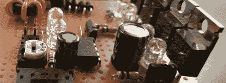

# 70 瓦的安培使用一个 ATtiny

> 原文：<https://hackaday.com/2012/09/05/70-watt-amp-uses-an-attiny/>

如果你正在寻找一个用最少的零件制作的 DIY 放大器项目，[这就是为你打造的](http://www.rdimitrov.info/blog/show.php?entry=Microcontroller%20Class%20D%20Amplifier)。[Rouslan]使用 ATtiny45 和价值几美元的附加元件制造了一个 70 瓦的 D 类放大器。

一个[D 类放大器](http://en.wikipedia.org/wiki/Class-D_amplifier)只是非常快速地开关 MOSFETs 的晶体管。通过将这些 MOSFETs 产生的信号通过低通滤波器并连接扬声器，D 类放大器能够非常有效地放大信号。通常，这种放大器的构建使用一些深奥的元件，但是[Rouslan]发现了如何使用一个简单的 ATtiny 微控制器来驱动一组 MOSFETs。

在[Rouslan]的电路中，音频信号被传入 ATtiny45 的模拟输入端。在该微控制器内部，这些模拟值通过 PWM 输出发送到 MOSFETs。[Rouslan]加入了一些软件技巧(在他的版本的第二次修订中解释)来改善音质，但电路仍然非常简单。

[Rouslan]发布了一个视频，介绍了他的 ATtiny amp 的功能，从音频演示(休息后提供)来看，我们认为它听起来很不错。令人惊讶的好，甚至，如果你考虑这个 70 瓦的放大器实际上是多么的简约。

感谢[亚历克]送来这封信。

[https://www.youtube.com/embed/CrAB9rIcakE?version=3&rel=1&showsearch=0&showinfo=1&iv_load_policy=1&fs=1&hl=en-US&autohide=2&wmode=transparent](https://www.youtube.com/embed/CrAB9rIcakE?version=3&rel=1&showsearch=0&showinfo=1&iv_load_policy=1&fs=1&hl=en-US&autohide=2&wmode=transparent)