# Disco Planet，一个 6 英尺高的巨型 RGBW LED 阵列

> 原文：<https://hackaday.com/2012/09/11/disco-planet-a-massive-rgbw-led-array-in-a-6-globe/>

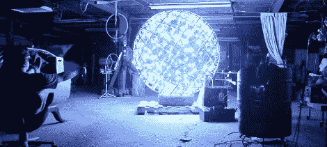

大约半年前，弗兰克厨房的约翰带着一个大型照明项目的想法来找我。他从费城剧院公司抢救出这个直径 6 英尺的铝框地球仪，并希望它成为一种互动展示。经过几次讨论，我们聚在一起，设法订购了 800 个 3 瓦的红色、绿色、蓝色和白色 led。我们有一个在纸上运行良好的系统，并设法在情人节前为一场大型演出建立起来。它悲惨地失败了，甚至几乎没有点亮 led。很自然地，我把这件事看得太个人化了，并着手进行一次彻底的重新设计，朝着可数字寻址的 LED 灯条的方向发展。

除了构建一个疯狂的涡轮充电 LED 阵列，我还花了很多时间使用 Arduino Pro Mini (5V 16 MHz)、MSGEQ7 音频多路复用器( [PDF](https://www.sparkfun.com/datasheets/Components/General/MSGEQ7.pdf) )和 IR 遥控器编写了一个漂亮、干净、功能齐全的 RGB LED 条形控制器。我计划在其他项目中使用这个，这样代码可以很容易地重新配置，以使用许多不同的 LED 灯条和一系列红外遥控器。

地球仪的示意图是这里的。该示意图的上半部分使用各种预制的 LED 灯条来迎合其他项目。带代码的 pastebin 是[这里](http://pastebin.com/25ugwNhK)，fastSPI_LED 和非远程[这里](http://code.google.com/p/fastspi/)和[这里](http://www.arcfn.com/2009/08/multi-protocol-infrared-remote-library.html)。为了让 IRRemote.h 和 FastSPI_LED 能够很好地配合工作，需要进行一些代码调整，所以请查看代码注释。

在开始建造的时候，我有一个巨大的框架，上面有红色、绿色、蓝色和白色的发光二极管，排列在铝制支架上的像素中。我不得不剥掉一吨超大号的电线，和两块完全毁坏的挂钉板。我不断被问到 Peggy 2 系统是否可以复活；除了 Peggy 提出的编码噩梦(至少对于我这种水平的程序员来说)。最初的目标是为每个 LED(总共 720 个)单独供电，并使用单独的 PWM 信号适当地减弱它们。这在 Peggy 上是不可能的，因为它依赖于数组的一次一行的枚举。请记住，该系统非常棒，非常适合低功耗应用。我们将高功率驱动器绑在每一列，将高电流 MOSFET 绑在每一行。下面是一个恐慌的“短路每个驱动程序的每个控制引脚，只是点亮它”的版本，但它只能熄灭少量的光。所有东西都得搬走。甚至我的大礼帽。

因为彻底检修现在是我的项目，我的预算和我的钱，我不得不把 LED 驱动器每个控制在一美元以下。每个不到一美元。进入:中国。我设法源一些疯狂的 12V 交流驱动器，这意味着取代轨道照明。在数据手册中未显示的某些配置中，这些板使用 MC34063 开关调节器( [PDF](http://www.sparkfun.com/datasheets/IC/MC34063A.pdf) )。后来，我有了一个逆向工程的原理图，但对它试图完成的工作毫无头绪。花了一些谷歌搜索，但我设法找到了 ic 的[电流驱动示意图](http://e2e.ti.com/cfs-file.ashx/__key/telligent-evolution-components-attachments/00-196-00-00-00-07-14-05/TI_2D00_LED_2D00_Driver.jpg)，主要是因为我的[不会拼写](https://www.google.com/search?num=20&hl=en&safe=off&sa=X&ei=5SxNUM_sEeeM0QHN5oCYDw&ved=0CBwQvgUoAA&q=MC34063+hysteritic&nfpr=1)。原理图看起来就像我的图纸，并有一个很好的简单方法泵入芯片，引脚 5 低速 PWM 信号。酷，这是如此简单:只需剥离引脚 5，用一个 3 引脚连接器取代输入引脚，并将中间引脚连接到芯片。

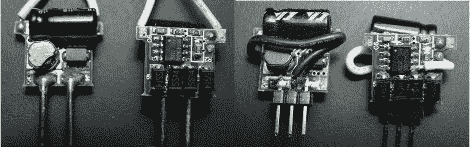

它用 PWM 信号工作得非常好。现在我不得不这样做… 800…次。

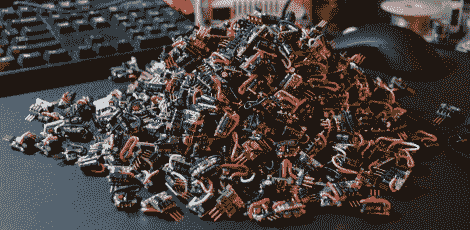

为了提供 PWM 信号，我需要一些便宜、可用、简单且功能强大的东西。我测试了几种驱动驱动程序的方法，并选定了 WS2801。这种芯片很容易找到，价格便宜，并通过串行输入和串行输出引脚处理所有串行信号传输和升压。最大的问题是，这个芯片只能控制 RGB，而不是 RGBW。这实际上是一个巨大的问题，一切都是为了迎合 RGB 阵列，这里我有一个巨大的(昂贵的)RGBW 设置。由于每个 WS2801 控制三个 led，我决定将白色 led 钉在每四个驱动器上。我还没有用这种方式让我的代码工作，所以视频中的输出看起来有点古怪。

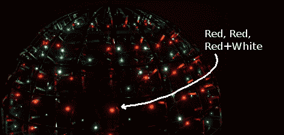

每个印刷电路板在运行时可以吸收高达 2A 的电流(在 12V 线路上)。为了供应 60 块这样的板，我设法找到了几个热插拔服务器电源。实际上是 6 个，每个都提供高达 52 安培的最大电流。我还买了控制器板，他们插入和撬开连接器，安装到性能板。我在整个项目中几乎完全使用了以太网线，它会融化和短路，而且不喜欢弯曲超过几次。太可怕了。虽然电线很便宜，但我仍然在争论，考虑到我没有用连接器测试过它，用连接器设计这个东西的几百美元是否值得节省时间。

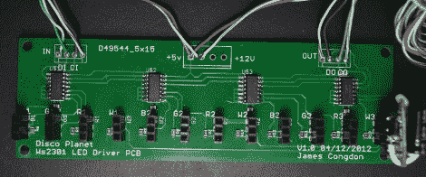

无论如何，这是一个非常有趣的项目。我仍然需要整理一些有问题的 LED 驱动器，并将驱动板粘在印刷电路板上(它们会在运输过程中被拔掉)。我计划多做几个这样的控制器电路，因为我必须在远离商店的地方测试两种状态的代码，我也可以把它们放在其他东西里。声音反应大礼帽？也许我可以激励[Caleb]用他的 RGBW 地球仪做更多的事情。这是控制器部件的分解图:

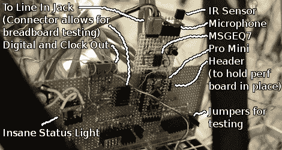

下面是我最后安装驱动电路那天的蹩脚视频，下面是第一个“哇哦我的代码工作”视频。我会有一个更好的视频来展示电路和模式和红外，但我必须使用我的试验板部分在地球上！我用我的椅子碾过我的备用麦克风转接板，彻底压碎了这个可怜的小家伙。

[https://www.youtube.com/embed/v-bGqV5o_bE?version=3&rel=1&showsearch=0&showinfo=1&iv_load_policy=1&fs=1&hl=en-US&autohide=2&wmode=transparent](https://www.youtube.com/embed/v-bGqV5o_bE?version=3&rel=1&showsearch=0&showinfo=1&iv_load_policy=1&fs=1&hl=en-US&autohide=2&wmode=transparent) [https://www.youtube.com/embed/nLmlFjeQ4bs?version=3&rel=1&showsearch=0&showinfo=1&iv_load_policy=1&fs=1&hl=en-US&autohide=2&wmode=transparent](https://www.youtube.com/embed/nLmlFjeQ4bs?version=3&rel=1&showsearch=0&showinfo=1&iv_load_policy=1&fs=1&hl=en-US&autohide=2&wmode=transparent)

也只是为了惹恼那些试图向下滚动到评论区的人，这里有一个大型项目的大量照片。查看评论了解更多信息。还有一些不错的计算机背景资料。

[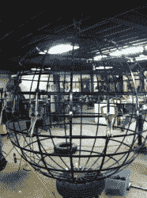](https://hackaday.com/2012/09/11/disco-planet-a-massive-rgbw-led-array-in-a-6-globe/01_itlooksnaked/)[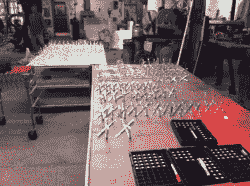](https://hackaday.com/2012/09/11/disco-planet-a-massive-rgbw-led-array-in-a-6-globe/02_bracketsandbracketsandbracketsand/)[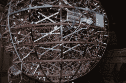](https://hackaday.com/2012/09/11/disco-planet-a-massive-rgbw-led-array-in-a-6-globe/03_oursaretheoldwaysofsolderand/)[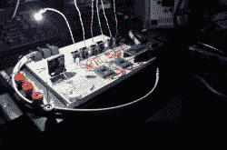](https://hackaday.com/2012/09/11/disco-planet-a-massive-rgbw-led-array-in-a-6-globe/04_firstfiotest/)[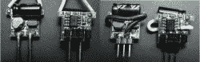](https://hackaday.com/2012/09/11/disco-planet-a-massive-rgbw-led-array-in-a-6-globe/05_drivermod/)[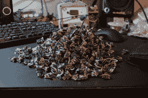](https://hackaday.com/2012/09/11/disco-planet-a-massive-rgbw-led-array-in-a-6-globe/06_driverpile/)[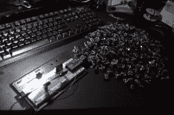](https://hackaday.com/2012/09/11/disco-planet-a-massive-rgbw-led-array-in-a-6-globe/07_driverpiletest/)[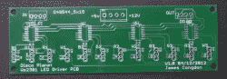](https://hackaday.com/2012/09/11/disco-planet-a-massive-rgbw-led-array-in-a-6-globe/08_pcbfront/)[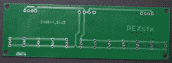](https://hackaday.com/2012/09/11/disco-planet-a-massive-rgbw-led-array-in-a-6-globe/09_pcbback/)[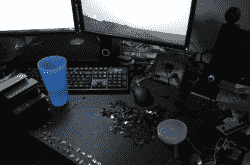](https://hackaday.com/2012/09/11/disco-planet-a-massive-rgbw-led-array-in-a-6-globe/10_jigforconnectors/)[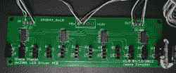](https://hackaday.com/2012/09/11/disco-planet-a-massive-rgbw-led-array-in-a-6-globe/11_threepixelpcb/)[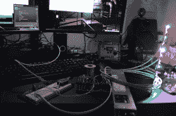](https://hackaday.com/2012/09/11/disco-planet-a-massive-rgbw-led-array-in-a-6-globe/12_pcbtest/)[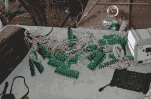](https://hackaday.com/2012/09/11/disco-planet-a-massive-rgbw-led-array-in-a-6-globe/14_pcbstoinstall/)[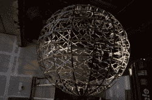](https://hackaday.com/2012/09/11/disco-planet-a-massive-rgbw-led-array-in-a-6-globe/15_pcbsmounted/)[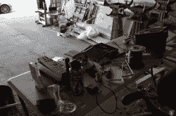](https://hackaday.com/2012/09/11/disco-planet-a-massive-rgbw-led-array-in-a-6-globe/16_mobilelab/)[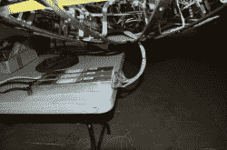](https://hackaday.com/2012/09/11/disco-planet-a-massive-rgbw-led-array-in-a-6-globe/17_hemispherepower/)[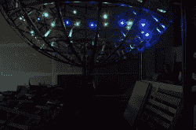](https://hackaday.com/2012/09/11/disco-planet-a-massive-rgbw-led-array-in-a-6-globe/18_rowtest/)[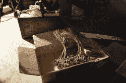](https://hackaday.com/2012/09/11/disco-planet-a-massive-rgbw-led-array-in-a-6-globe/19_driverstoinstall/)[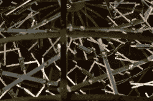](https://hackaday.com/2012/09/11/disco-planet-a-massive-rgbw-led-array-in-a-6-globe/22_pcbbackground/)[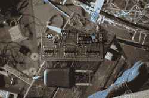](https://hackaday.com/2012/09/11/disco-planet-a-massive-rgbw-led-array-in-a-6-globe/23_expensivewirestripper/)[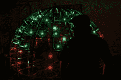](https://hackaday.com/2012/09/11/disco-planet-a-massive-rgbw-led-array-in-a-6-globe/24_fattyme/)[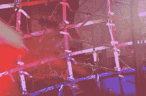](https://hackaday.com/2012/09/11/disco-planet-a-massive-rgbw-led-array-in-a-6-globe/25_artsyshot/)[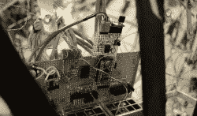](https://hackaday.com/2012/09/11/disco-planet-a-massive-rgbw-led-array-in-a-6-globe/26_brain/)[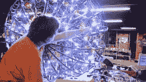](https://hackaday.com/2012/09/11/disco-planet-a-massive-rgbw-led-array-in-a-6-globe/28_eatfingerquebec/)[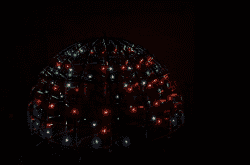](https://hackaday.com/2012/09/11/disco-planet-a-massive-rgbw-led-array-in-a-6-globe/29_johnsawesomeshot/)[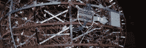](https://hackaday.com/2012/09/11/disco-planet-a-massive-rgbw-led-array-in-a-6-globe/olddesignsmall/)[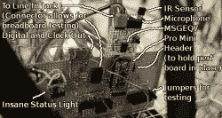](https://hackaday.com/2012/09/11/disco-planet-a-massive-rgbw-led-array-in-a-6-globe/brainlabels/)[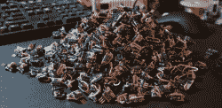](https://hackaday.com/2012/09/11/disco-planet-a-massive-rgbw-led-array-in-a-6-globe/driverpile/)[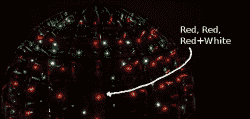](https://hackaday.com/2012/09/11/disco-planet-a-massive-rgbw-led-array-in-a-6-globe/dsc_0340/)[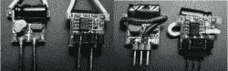](https://hackaday.com/2012/09/11/disco-planet-a-massive-rgbw-led-array-in-a-6-globe/drivermodsmall/)[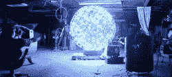](https://hackaday.com/2012/09/11/disco-planet-a-massive-rgbw-led-array-in-a-6-globe/videostillsmall/)[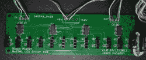](https://hackaday.com/2012/09/11/disco-planet-a-massive-rgbw-led-array-in-a-6-globe/threepixelpcbsmall/)