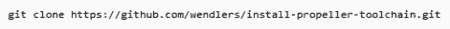

# 给手臂上的推进器编程

> 原文：<https://hackaday.com/2012/09/07/programming-a-propeller-on-an-arm/>

[Stefan]在他的开发工作中使用了一个小型的 ARM 驱动的上网本，所以当他试图使用 Parallax Propeller 时，他遇到了一些问题。Parallax 的官方工具仅适用于 Windows，可用的第三方开发工具仅针对 x86 编译。在做了大量的无用功之后，[Stefan] [能够在他的 ARM 上网本](http://gpio.kaltpost.de/?page_id=1378)上进行开发，并写信告诉我们是如何完成的。

幸运的是， [Parallax 为螺旋桨](http://hackaday.com/2012/06/20/parallax-shows-love-for-open-source-gcc-propeller/)发布了一个 GCC 端口，但不幸的是并不能完全移植到 ARM 上。这种架构矛盾构建的 Propeller 加载程序使用了一点 SPIN 代码，这些代码只能在 Intel 机器上编译。

为了解决这个问题，[Stefan] [编写了一个安装程序脚本](https://github.com/wendlers/install-propeller-toolchain)来收集所有必要的代码到他的计算机上。他的 ARM/Linux 工具链由 Propeller GCC、[、开源 SPIN 编译器](http://code.google.com/p/open-source-spin-compiler/)和用于加载 Propeller 论坛上的代码的 Python 脚本【Stefan】组成。

现在[Stefan]已经有了一个完整的工具链来为 ARM 设备上的 Propeller 编程，因此有可能在他的上网本甚至是 Raspberry Pi 上为这个非常酷的多核微控制器进行开发。