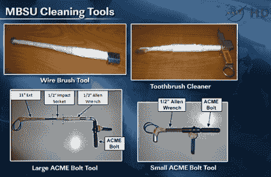

# 破解牙刷拯救国际空间站

> 原文：<https://hackaday.com/2012/09/07/saving-the-iss-by-hacking-a-toothbrush/>

我们绝对喜欢这些黑客独创性拯救人们生命的故事。在这种情况下，它是在国际空间站上，被黑客攻击的物品是牙刷。

故事是这样的。一些设备失灵了，就像太空垃圾经常发生的那样，宇航员发现他们自己需要做一些修理。经检查，由于一些螺栓周围积聚了“空间灰尘”，他们无法移除一些模块。这尤其令人不安，因为这个有问题的装置应该是从一些太阳能电池阵列向国际空间站供电的。更麻烦的是，在他们评估情况的时候，另一个单元出了故障。

意识到他们必须快速行动，以免失去太多的电力来运行，他们拼凑了一些工具，让他们清理访问端口，并拆除单元进行维修。一项在地球上听起来很容易解决的任务在太空中被证明是威胁生命的。然而最终，他们的临时工具来救援，他们能够修复和恢复电力。