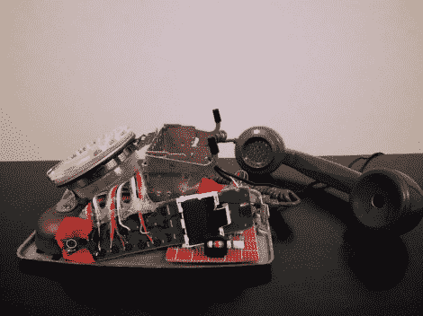

# 旋转式和无绳电话混搭

> 原文：<https://hackaday.com/2012/09/07/rotary-and-cordless-phones-mashup/>

这堆硬件结合了明显不同代的电信硬件。[Andrew D. Farquharson]想要旋转式电话的复古外观和操作，以及现代无绳电话的便利性。他结合了两种技术来实现他的目标。

第一个问题是要找到一种方法将扶轮输入转化成他可以使用的东西。已经有一堆[项目使用旋转硬件](http://hackaday.com/2010/02/26/lower-productivity-by-using-a-rotary-num-pad/)，所以他没有必要重新发明轮子。他按照[这个指南将 Arduino 连接到旋转式电话](http://www.instructables.com/id/Interface-a-rotary-phone-dial-to-an-Arduino)。

下一步是连接他的无绳电话。他扔掉了盒子，将彩虹带状电缆焊接到整个按钮矩阵上。每次连接时，光隔离器用于保护 Arduino。最后，他接入了监控听筒座的机制，以查看听筒是否被拿起。听起来他的代码让你在拨号盘上输入号码，然后拿起听筒，通过无绳电话进行实际传输。