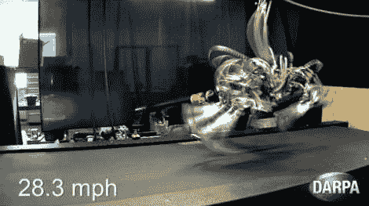

# 猎豹机器人甚至能跑得过我们当中最快的人

> 原文：<https://hackaday.com/2012/09/07/cheetah-robot-can-run-down-even-the-fastest-of-us/>

很模糊，但你真的不想看到这东西来找你。这是波士顿动力公司根据 DARPA 合同所做工作的最新进展。他们称它为猎豹机器人，因为它是有史以来最快的四足机器人。休息后的剪辑显示它打破了 100 米的世界纪录…对一个人来说。这实际上是不合法的，因为跑步是在跑步机上进行的，机器人是拴着的。但还是~~令人印象深刻~~令人害怕。

猎豹是大狗的亲戚，大狗是波士顿动力公司的另一个机器人，我们在过去见过几次。大狗擅长举起重物和穿越崎岖的地形。我们认为，用不了多久，这两种特性就能被“培育”到一种设备中。很多时候，当我们特写这些机器人时，会有一些评论说它们是如何从《T2》和《终结者 3》电影中调用图像的。对我们来说，这更像是[迈克尔·贝]对《T4》变形金刚系列中机器人的想象。它肯定不够小或不够快，不能被看作是早期版本的[鼠的东西](http://en.wikipedia.org/wiki/Snow_Crash#Rat_Things)。

[https://www.youtube.com/embed/YqpO58x7vuE?version=3&rel=1&showsearch=0&showinfo=1&iv_load_policy=1&fs=1&hl=en-US&autohide=2&wmode=transparent](https://www.youtube.com/embed/YqpO58x7vuE?version=3&rel=1&showsearch=0&showinfo=1&iv_load_policy=1&fs=1&hl=en-US&autohide=2&wmode=transparent)

[通过 [EnDanDit](http://www.endandit.nl/science/060921667/robot-cheetah-loopt-harder-dan-usain-bolt) 感谢费迪南]