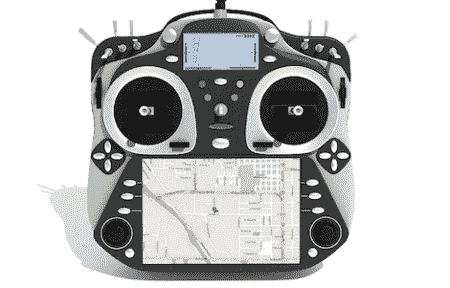

# 远程控制无所不能

> 原文：<https://hackaday.com/2012/09/10/remote-control-does-everything/>

经过一年的开发，[OSRC 已经准备好投产制造工厂](http://www.os-rc.com/)。这种用于遥控汽车、飞机、四轴飞行器和半自动无人机的发射器(和接收器)具有模块化的*一切*，并允许你从驾驶舱传输视频并在你手掌的屏幕上显示。

这不是我们第一次[在 OSRC](http://hackaday.com/2012/03/30/the-rc-transmitter-that-does-everything/) 上发布一些东西，但从那以后【德米特里斯】，团队负责人已经发布了大量关于 OSRC [主单元](http://www.os-rc.com/products/117-osrc-main-unit)，夹式 [FPV 显示器](http://www.os-rc.com/products/119-fpvc-advanced)，以及与 OSRC 一起操作的[接收器和发射器模块](http://www.os-rc.com/products)的能力的信息。

不幸的是，[德米特里斯]花了很多钱开发 OSRC，[现在正在做一个伪 kickstarter](http://www.os-rc.com/) ，表面上是为了评估利息，减轻银行在申请小企业贷款时的担忧。如果一切按计划进行，OSRC 基地单位应成本约€300，一个很大的数目，但真的没有那么糟糕，考虑到 OSRC 只是比其他高端钢筋混凝土发射机。

我们希望有足够多的人会站出来，承诺在 OSRC 投入生产后购买它，否则我们将再等几年，RC 发射机游戏中的大牌才能推出类似的产品。