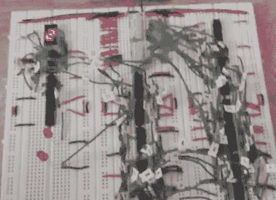

# 4 位 ALU 的试验板

> 原文：<https://hackaday.com/2012/09/10/breadboarding-a-4-bit-alu/>

[TGTTGIT]最近冒了一次险，决定用逻辑芯片建造自己的计算机。他刚刚完成了一个可以计算 18 个函数的 4 位 ALU。布线花了很长时间，但在真正的极客时尚中，他的建造伴随着交替的*查佩尔的表演*和*星际迷航:TNG* 马拉松比赛作为背景。

这个项目是一个更大的 16 位版本的垫脚石。布线这么多的经验让他相信 FPGA 是未来建筑的唯一出路。但是因为他已经点了薯条，所以他们决定唯一能做的就是坚持到底。他在设计中使用了*计算系统的元素*中的真值表，并在到达这个停止点之前发布了几次关于这个项目的帖子，所以你可能有兴趣点击他博客上的其他帖子。这里还有很多其他的 [TTL 计算机项目值得一查](http://hackaday.com/2012/05/07/build-an-8-bit-ttl-computer/)。

[https://www.youtube.com/embed/NVcyhtcDeW8?version=3&rel=1&showsearch=0&showinfo=1&iv_load_policy=1&fs=1&hl=en-US&autohide=2&wmode=transparent](https://www.youtube.com/embed/NVcyhtcDeW8?version=3&rel=1&showsearch=0&showinfo=1&iv_load_policy=1&fs=1&hl=en-US&autohide=2&wmode=transparent)