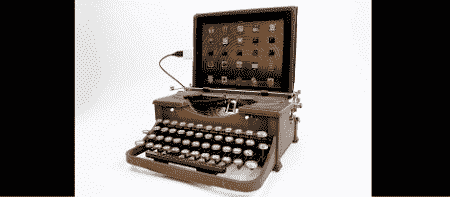

# 打字机是 USB 键盘，也牛逼

> 原文：<https://hackaday.com/2012/09/11/typewriter-is-usb-keyboard-also-awesome/>

如果你是一个沉思的作家，一边在星巴克喝着拿铁咖啡，一边对下一部伟大的美国小说进行最后的润色，那么 MacBook 太普通了，以至于无法打动狂饮焦糖玛奇朵的无文化无产者。不，要给坐在你旁边的下一个(乔伊斯)或(T. S .艾略特)留下深刻印象，你需要更时髦的东西，比如把打字机变成 USB 键盘的套件。

这个把旧安德伍德变成 USB 键盘的工具包来自费城黑客空间 Hive 76 的成员[Jack Zylkin]的绘图板。[杰克]设法使把旧打字机变成键盘的过程变得相对容易。

[Jack]创造了一个装载 74HC595 移位寄存器的传感器板，可以轻松安装到任何打字机的框架上。当打字机上的一个键被敲击时，机械杠杆敲击焊接在传感器板上的金属条。ATMega 微控制器记录这些按键，并通过 USB 端口发送它们，就像任何其他 USB 键盘一样。

将打字机改造成 USB 键盘是我们害怕的项目之一；你可能会认为有许多小的电触点和肮脏的机械装置会有太多的浪费。[Jack]事实上，我们设法组装了一套非常好的工具，把打字机变成了键盘。

你可以在[【杰克】的 etsy 商店](http://www.etsy.com/shop/usbtypewriter?ref=top_trail)买到一套工具，但是用一点 perf 板做同样的事情也不是不可能的。休息后的精彩视频。

[https://player.vimeo.com/video/49029298](https://player.vimeo.com/video/49029298)