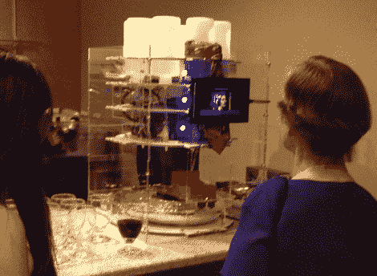

# 机器人酒吧投标记录婚礼宾客喝醉

> 原文：<https://hackaday.com/2012/09/11/robot-bar-tender-records-wedding-guests-getting-drunk/>

拥有一个开放的酒吧通常意味着雇佣至少一个酒吧投标人。但是这个黑客通过让一个机器人负责事情，消除了那些劳动力成本(以及确保你十几岁的堂兄弟姐妹不喝酒的人)。但乐趣不止于此。这个调酒师的一个特点是[它每次分发饮料](http://andrewparra.net/bender/)都会录制一段 30 秒的视频。我们会想象，随着时间的推移，在戏剧性地转变为悲伤之前，这些事情会变得有点滑稽。

上面的链接分享了该设备的大量细节，因此请确保您点击浏览了导航栏中的不同页面。机械页面展示了在 Solidworks 中设计机器的所有努力。配料从倒置的瓶子的顶层开始。每个都供给一个有自己喷嘴的阀门。就像醉酒者的圆形版本一样，一个玻璃杯被放在底部的小车上，小车绕着机器的中心转动。一旦它回到丙烯酸盒的开口处，你就可以拿起你的饮料，快速搅拌一下，然后就可以开始了。

休息后看看视频，看看用户界面，其中包括为这对幸福的夫妇录制的视频问候。

[https://www.youtube.com/embed/371lgYzPtRs?version=3&rel=1&showsearch=0&showinfo=1&iv_load_policy=1&fs=1&hl=en-US&autohide=2&wmode=transparent](https://www.youtube.com/embed/371lgYzPtRs?version=3&rel=1&showsearch=0&showinfo=1&iv_load_policy=1&fs=1&hl=en-US&autohide=2&wmode=transparent)