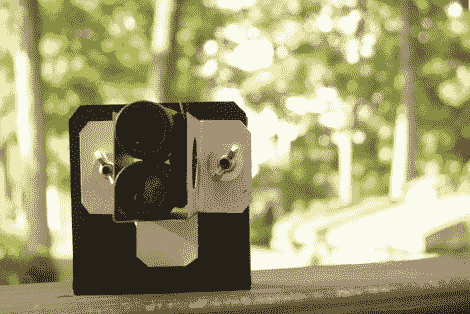

# 作为变焦镜头的双筒望远镜

> 原文：<https://hackaday.com/2012/09/11/binoculars-as-a-zoom-lens/>

乍一看，这似乎微不足道，但是当[使用双筒望远镜作为长焦镜头](http://unitips.ca/?p=401)时【Dan】得到的效果是令人惊讶的。图像清晰，色彩绚丽。这种技术不仅使你的主题更近，而且还提供了一种简单的相机或拍照手机通常不具备的景深功能。

证据就在休息后找到的示例片段中，但你也可以找到详细描述构建的视频教程。[Dan]已经有了昂贵的组件，包括一副迷你双筒望远镜和一台柯达 Zx3 便携式摄像机。该摄像机与智能手机的外形相同，因此使用不同的硬件将轻而易举。他首先用纸做了一个原型。基本上，它是一个支架，将相机与双筒望远镜的一个镜头正确对齐。一旦他把所有东西都排好，他就把他的尺寸转移到一些金属片上。使用螺栓和蝶形螺母将双筒望远镜的支架连接到相机的支架上，使其可调。设计的一个重要部分是开一个洞，以便接近双目对焦轮。

示例镜头:

[https://www.youtube.com/embed/PPOEdLWrOUk?version=3&rel=1&showsearch=0&showinfo=1&iv_load_policy=1&fs=1&hl=en-US&autohide=2&wmode=transparent](https://www.youtube.com/embed/PPOEdLWrOUk?version=3&rel=1&showsearch=0&showinfo=1&iv_load_policy=1&fs=1&hl=en-US&autohide=2&wmode=transparent)

构建教程:

[https://www.youtube.com/embed/fWBnDZzzuvs?version=3&rel=1&showsearch=0&showinfo=1&iv_load_policy=1&fs=1&hl=en-US&autohide=2&wmode=transparent](https://www.youtube.com/embed/fWBnDZzzuvs?version=3&rel=1&showsearch=0&showinfo=1&iv_load_policy=1&fs=1&hl=en-US&autohide=2&wmode=transparent)