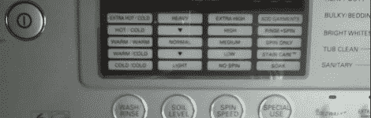
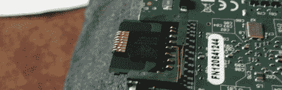

# 黑客日链接:2012 年 9 月 11 日

> 原文：<https://hackaday.com/2012/09/11/hackaday-links-september-11-2012/>

**劳氏 Xbee 传感器？**

家居装修大卖场 Lowe's 正在销售一些可能兼容 Xbee 的家庭自动化产品。它们在 T2 以 Iris T3 的品牌出售。关于它们是 Xbee，还是仅仅是 802.15.4 硬件，还有一些争论。无论哪种方式，它们都值得您的无线项目去检验。

**野蛮人柯南的父亲剑复制品**

有时候看大师工作很有趣。在这种情况下，[一个铁匠复制了《野蛮人*柯南》中的剑*](http://www.youtube.com/watch?v=8c2xiKFLnYY)。【经由[Reddit】](http://www.reddit.com/r/Blacksmith/comments/zna3t/a_guy_makes_a_conan_the_barbarian_inspired_sword/)

**打电话回家的 LG 洗衣机**

LG 在他们的一些洗衣机中内置了一个有趣的故障排除功能。[此视频显示了如果您使用正确的按钮组合，它将输出的编码音频](http://www.youtube.com/watch?v=oWfc_uHNh8c)。你应该拿着你的电话对着机器与客户服务人员交谈，他们将能够从拨号调制解调器类型的声音中获得某种类型的调试信息。如果你最终解码了这段音频[，我们想知道它](http://hackaday.com/contact-hack-a-day/)！[谢谢佩德罗]

**用于 Raspberry Pi 的 MicroSD 卡适配器**

[TopHatHacker]惊讶地看到树莓 Pi 上有一个全尺寸的 SD 卡插槽。他让他的 microSD 卡工作的临时解决方案是[使用 miniSD 适配器](http://tophathacker.com/mini-microsd-adapter/)。他切开外壳，弯曲针脚，直到它们与 microSD 卡对齐。

**复古摩托车发烧友的蝙蝠侠罩衫** s

好吧，我们认为这件 20 世纪 50 年代风格的蝙蝠侠斗篷很酷。你要意识到，如果有人看到你穿这件衣服，你会被认为是镇上的一个疯子。[通过[汪汪](http://boingboing.net/2012/09/10/howto-make-a-leather-rockabill.html)