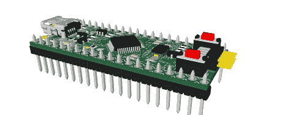

# 将代码拖放到该 ARM 开发板上

> 原文：<https://hackaday.com/2012/09/12/drag-and-drop-code-onto-this-arm-dev-board/>

在过去几个月我们看到的自制 ARM 开发板列表中，[Squonk42]的[USBug 是我们见过的最好的](http://squonk42.github.com/USBug/)之一。像许多其他 ARM 板一样，它将 Cortex M0/M3 系列的一个成员分成 40 引脚 DIP，但与所有其他产品不同的是，[Squonk]将其设计为可以像 USB 拇指驱动器一样将代码拖放到微控制器上。

[Squonk]的技巧依赖于某种恩智浦 LPC11xx/LPC13xx 微控制器。这些芯片具有基于 ROM 的大容量存储，这意味着你可以在你的桌面上编译代码，并简单地将其转移到 USBug，不需要外部程序员。这里是[相关的 app 笔记](http://www.nxp.com/documents/application_note/AN10905_lpc1300_usbmemrom.zip) (PDF 以 zip 文件的形式。双重打击)。

当然，USBug 具有你通常会从当前的 Cortex-M3 设备中期待的 I/O，同时提供 64 kB 的闪存和 12 kB 的 RAM。

[Squonk]说他想把 USBug 放到 Kickstarter 上，但不幸的是他不是美国公民。本着开放硬件的精神，或许一些制造商为基础的电子产品制造商将接手[Squonk]被迫中断的业务。