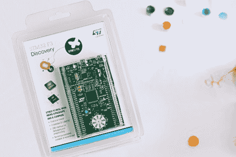

# STM32 F3 发现开发板包括一些额外功能

> 原文：<https://hackaday.com/2012/09/12/stm32-f3-discovery-dev-board-includes-some-extras/>

ST 微电子不断推出开发板来展示他们新的 ARM 处理器系列。昨天，他们发布了一份新闻稿，宣布 STM32 F3 发现板。正如他们的命名方案所暗示的那样，它搭载了 ARM Cortex-M3 处理器，但与[F0 发现板](http://hackaday.com/2012/05/30/video-review-stm32f0-discovery-board/)(我们很喜欢)相比，它内置了几个额外的好东西。

我们看了一下[F3 发现产品页面](http://www.st.com/internet/evalboard/product/254044.jsp)，看起来您还不能订购这些产品。但是点击价格，你会看到他们把价格定在 10.90 美元。Digikey 列出了这个价位的主板，Mouser 列出了大约 16 美元，但两家供应商都没有。我们也没有看到像 F0 型号发布时那样的免费主板链接。如果你确实遇到了一个免费链接[，请告诉我们这个链接](http://hackaday.com/contact-hack-a-day/)。

好了，现在我们来讨论一下这些额外的东西。我们认为这款开发套件可以用作四轴飞行器或自平衡机器人等应用的 IMU。这是因为它有一个陀螺仪和一个加速度计。它还有十个发光二极管，其中八个排列在白色圆圈上。我们猜测这个布局是用来显示 IMU 传感器的方位数据的。在为芯片开发 USB 应用程序时，还有第二个 USB 端口可供使用。

与 Discovery 系列中的其他板一样，它内置了 STlinkV2，可用作程序员。我们不知道 OpenOCD 是否支持 F3 芯片组，这是我们在 Linux 环境中用来编程 STM 芯片的芯片组。