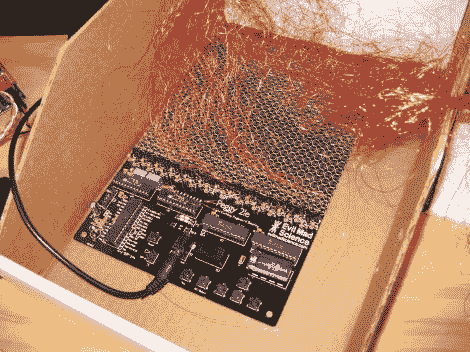

# 黑了佩姬

> 原文：<https://hackaday.com/2012/09/13/hacking-the-peggy/>

邪恶疯狂科学家实验室收到了一封电子邮件，邮件来自一个想要黑掉他们的佩吉工具包的人。这款 LED 矩阵套件已经在过去的中的[Hack a Day 上展示过，它提供了设置 625 LED 矩阵的硬件。](http://hackaday.com/tag/peggy/ "Peggy on HaD")

该用户构建了一个外部 led 阵列，他们希望用 Peggy 硬件来驱动它。有几个选项可以实现这一点。第一个是从电路板上的 625 个 LED 封装中的每一个引出导线。每个都有一个阳极和阴极，所以总共有 1250 根电线。事实证明，人们在过去已经用非常细的金属丝在佩吉身上做到了。

EMSL 建议对行和列进行布线。这样，每行和每列只需要一根导线，允许 25×25 LED 网格使用 50 根导线，而不是 1250 根。他们还解释了如何将网格扩展为 30×20 LED 矩阵。这很好地解释了该工具包是如何工作的，以及它是如何扩展的。

照片[ [奥斯卡伊](http://www.flickr.com/photos/oskay/)