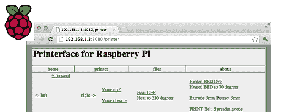

# Raspi 的 3D 打印机控制

> 原文：<https://hackaday.com/2012/09/13/3d-printer-control-for-the-raspi/>

[Walter]没有整晚用他的笔记本电脑来控制他的 RepRap，而是用树莓 Pi 作为他的 3D 打印机的互联网前端。

在[沃尔特]得到树莓酱之前，他把笔记本电脑放在他的 RepRap 旁边，让机器连续工作几个小时。显然，这暂时束缚了他的笔记本电脑，所以当他的 Raspi 交付时，他急于将控制打印机的责任转移到他的新 Linux 主板上。

现在，[Walter]已经将他的 Raspberry Pi 设置为一个网络界面，能够控制他的打印机，类似于 [Pronterface](https://github.com/kliment/Printrun) 。我们必须注意到，树莓 Pi 没有驱动伺服系统，也没有将细丝输送到床上；这些职责仍然由 RepRap electronics 处理，但通过网络使用 3D 打印机的能力仍然非常酷。

[Walter]正在对他的 3D 打印机网络界面进行最后的润色，之后他会把所有东西上传到 git 上。未来更新的计划功能包括从网络上传 gcode，以及在控制远程打印机时连接网络摄像头以获得视觉反馈的选项。

休息后的视频演示。

[https://www.youtube.com/embed/tsMdusrO6bk?version=3&rel=1&showsearch=0&showinfo=1&iv_load_policy=1&fs=1&hl=en-US&autohide=2&wmode=transparent](https://www.youtube.com/embed/tsMdusrO6bk?version=3&rel=1&showsearch=0&showinfo=1&iv_load_policy=1&fs=1&hl=en-US&autohide=2&wmode=transparent)