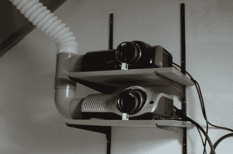

# 在你的阁楼上建造一个被动 3D 投影系统

> 原文：<https://hackaday.com/2012/09/13/building-a-passive-3d-projection-system-in-your-attic/>

虽然整个 3d 电影/游戏热潮似乎正在升温，但这真的不是什么新鲜事。我们都记得那些在电影院流行过一段时间的花哨的红蓝眼镜，但我说的不是那个。被动 3d 投影(使用偏振眼镜)也已经出现了一段时间。许多人已经想出了在家里建造这些系统的廉价方法，但是直到最近我们才看到为他们大量创造的媒体。现在，你可以在当地的盒子商店购买 3d 游戏和电影，在家里拥有 3D 系统的诱惑就更大了。

这里有一篇关于如何组装一个相当简单的投影系统的精彩文章，该投影系统使用两个相同的带偏振滤光器的投影仪。基本上，你只需要两台投影仪、两个滤镜、一个屏幕和眼镜。线程中有大量的安装和设置技巧，以帮助减轻您可能会遇到的任何头痛。

该系统主要用于 PC，因为它需要两个视频输入才能工作。成本明细可能会让你想知道为什么不直接跳到亚马逊上，用不到 400 美元的价格买一台 32 英寸的 3d 电视，但是坐在那个巨大的屏幕前可能会让你明白。