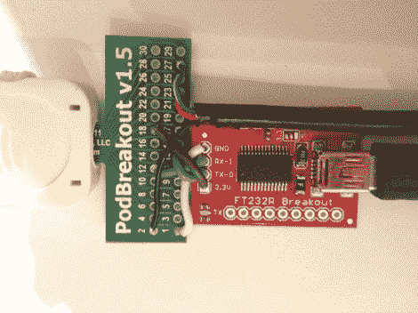

# IOS 终端调试工具

> 原文：<https://hackaday.com/2012/09/13/ios-terminal-debugging-tool/>

这是一个简单的 iOS 调试工具,很快就可以焊接在一起。甚至有可能你手头已经有了你需要的一切。黑客只需将 RS232 转 USB 转换器连接到 iPod 连接器的分线板。

该硬件并不针对现有的 iOS 系统，而是为那些希望在其上运行替代操作系统的人提供帮助。当 OpeniBoot 包在 iPod Touch 或 iPhone 上运行时，它会启用引脚 12 和 13 上的串行终端。FTDI 分线板将这些作为 RX 和 TX，并通过 USB 将其用于您选择的终端程序。说到 USB，你可能已经注意到了图片右侧的黑色电缆。使用终端不会限制您使用设备的 USB 功能。