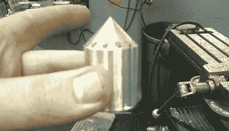

# 在家制作塑料细丝

> 原文：<https://hackaday.com/2012/09/14/making-plastic-filament-at-home/>

RepRap 和 Makerbot 等塑料挤出 3D 打印机的流行有一个问题；由于它们变得如此受欢迎，塑料丝的价格在过去几年里飞涨。如果没有办法在黑客空间或家庭实验室生产细丝，3D 打印物体的价格将仍然相当高。意大利面条计划希望通过建造一台机器来制造 3D 打印机的塑料细丝来纠正这种情况。

意大利面项目(Project Spaghetti)背后的人——一个以开源印刷有限责任公司(Open Source Printing，LLC)为名的制造商的松散合并——已经成功建造了一台能够生产短长度塑料细丝的机器。

早期的机器使用活塞通过加热的钢管挤压 ABS 塑料小颗粒来生产细丝。这种方法有一些问题，特别是当温度设置为 480 华氏度时，但是团队能够用这种设计让 T2 制造出一点灯丝。

虽然该团队使用活塞将熔化的塑料从喷嘴中挤出，但他们确实有[一个螺丝驱动的“B 计划”在进行中](http://projectspaghettidinner.wordpress.com/2012/08/18/plan-b/)。这种设计应该允许连续挤压理论上无止境的塑料细丝卷轴，这是每个记者的梦想，也是[赢得 4 万美元](http://hackaday.com/2012/05/22/win-40000-for-squirting-plastic-out-of-a-nozzle/)的一个简单方法。