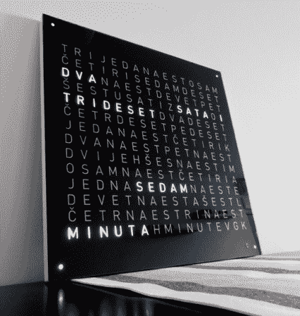

# 令人难以置信的制造工艺使这个字钟脱颖而出

> 原文：<https://hackaday.com/2012/09/17/incredible-fabrication-process-makes-this-word-clock-stand-out/>

从表面上看，他只是另一个单词时钟，对吗？也许从外面看。但是如果你[看一看建造照片](http://www.elektronika.ba/841/word-clock/)这是一个极端捏造的好例子。该设计采用了玻璃边框、乙烯基字母、扩散器、安装板和背板的五层叠层。安装和刻字层是劳动密集型的，但也是华丽的成品外观的原因。

边框由贴在玻璃面板背面的黑色粘合箔组成。这些字母是用乙烯基切割机切割出来的，层压过程发生在一个水池中。这种技术有助于确保玻璃和铝箔之间没有细小颗粒。

木制安装支架是从当地橱柜制造商处订购的。它是 17.7 英寸的中密度纤维板，边缘包裹着光滑的白色 PVC。一旦它到达，[穆里斯]开始钻 248 个洞和他们的反沉。这是在该层的正面，当喷上银色涂料时，这些水槽起到反射器的作用。在背面，他铣出凹槽来接受 PCB 带，以容纳 led 以及容纳 MAX7219 驱动器的分线板。

不要错过休息后展示最终产品的视频剪辑。

[https://www.youtube.com/embed/PbtWs3_Ygfk?version=3&rel=1&showsearch=0&showinfo=1&iv_load_policy=1&fs=1&hl=en-US&autohide=2&wmode=transparent](https://www.youtube.com/embed/PbtWs3_Ygfk?version=3&rel=1&showsearch=0&showinfo=1&iv_load_policy=1&fs=1&hl=en-US&autohide=2&wmode=transparent)