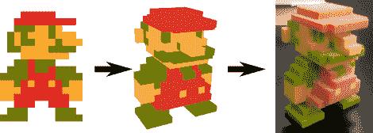

# 将视频游戏精灵转化为 3D 物体

> 原文：<https://hackaday.com/2012/09/19/turning-video-game-sprites-into-3d-objects/>

任何玩过*《我的世界》*很长时间的人都应该很好地掌握了通过逐块放置体素来制作 3D 物体的方法。在你的底座后面有一个巨大的体素艺术龙很酷，但是在你的基于块的艺术作品后面的数学呢？【mikolalysenko】[整理了一个用视频游戏精灵制作 3D 物体的教程](http://0fps.wordpress.com/2012/09/18/turning-8-bit-sprites-into-printable-3d-models/)，涵盖了大量将像素转化为体素的数学知识。

从一系列 2D 图像中建模 3D 物体的过程是被称为多视图立体重建的非常好研究的计算机视觉问题。这一过程已经被用于用诸如[斯坦福球形门架](http://graphics.stanford.edu/projects/gantry/)之类的设备构建随机物体的 3D 模型。不幸的是，这种算法的数学很糟糕，但还有另一种方法:使用[照片外壳](http://www.cs.cmu.edu/~seitz/papers/kutu-ijcv00.pdf) (PDF 警告)从一系列显示俯视、仰视、左视、右视、前视和后视的图像中找到最大可能的物体。

[mikolaly]整合了一种算法，从一系列图像中产生 3D 图像，甚至还建立了一个基于网络的形状雕刻编辑器。有了这个网络应用，只需在六个 2D 网格上输入一串彩色像素，就可以制作出 3D 物体。

一旦模型完成，[mikolaly]将一些 3D 模型送到 Shapeways 进行 3D 打印。他已经完成了《肉童》、《马里奥》和《林克 3D 精灵》，[全部可以出售](http://www.shapeways.com/shops/0fps)。

现在剩下唯一要做的事情就是构建一个脚本，将这些对象转换成*《我的世界》*对象示意图。