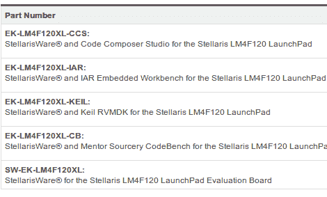

# 关于 TI 微控制器产品附带的开发文件

> 原文：<https://hackaday.com/2012/09/19/regarding-the-development-files-that-accompany-tis-microcontroller-offerings/>

我们收到来自[杨奇煜]的消息，德州仪器[在他们的下载页面上发布了一组 stellar is launch pad](http://www.ti.com/tool/sw-ek-lm4f120xl)的 ide。起初，我们跳过了这个链接，但后来决定看看自 MSP430 Launchpad 发布以来情况是否有所变化。正如我们所预料的，如果您想在不使用这些 ide 的情况下开发硬件，那么在这个页面上没有任何帮助。

我们为什么要放弃 TI 提供的预配置开发环境？首先，他们只提供试用许可证。当你去下载一个软件包时，你必须费力地通过一个令人吃惊的非出口协议。当我们做到这一步时，我们下载的大约 500 MB 的 Sourcery 包非常慢。我们看不到在 Linux 机器上安装这些软件的任何选项。无论您选择什么操作系统，我们认为您应该能够使用相同的开发环境为任何架构开发——无论是 Eclipse、GNU Emacs、Notepad 还是其他。我们不想下载一个巨大的软件包只是为了试用一个新的芯片。

我们知道您可以使用 arm-none-eabi 这样的标准交叉编译器为 Stellaris ARM 芯片进行开发(我们使用 Sourcery CodeBench Lite —以前的 CodeSourcery G++ lite)。我们希望 TI 计划添加一个准系统包，为硬件提供一个简单的 Makefile、链接器脚本和基本库。但我们不会屏住呼吸。毕竟，省略 Linux 支持是[行业标准。](http://hackaday.com/2011/10/17/how-to-develop-for-stm32-discovery-boards-using-linux/)