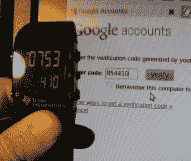

# 使用 EZ430 Chronos 手表进行 Gmail 令牌认证

> 原文：<https://hackaday.com/2012/09/20/token-authentication-for-gmail-using-a-ez430-chronos-watch/>

双因素身份验证允许您使用自己选择的密码以及一次性密码来帮助保护您的服务的安全。传统上，一次性密码来自专用的硬件，但也有智能手机的解决方案。[Patrick Schaumont]展示了如何使用 [TI eZ430 Chronos 腕表生成认证令牌](http://circuitcellar.com/featured/ti-chronos-one-time-passwords/)。走完流程后，他用它来增强自己的 gmail 登录。

这种令牌身份验证方法通常称为基于时间的一次性密码(TOTP)。这是开放认证(OATH)倡议的一部分，该倡议旨在解决现代计算中的密码问题。便携式设备通过将算法和私有加密密钥应用于 accuarte 时间戳来生成密码。在服务器端，公钥用于验证基于服务器自己的时间戳输入的一次性密码。在这种情况下，便携设备是 Chronos 手表，服务器是谷歌自己的 TOTP 服务。

你可以用其他简单的微控制器做到这一点，我们甚至已经看到了 Arduino 实现。但这里看到的腕表外形是迄今为止最方便的——只要你一直记得戴着手表。

[感谢氧化物]