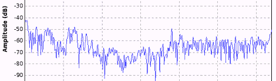

# 黑客日链接:2012 年 9 月 21 日

> 原文：<https://hackaday.com/2012/09/21/hackaday-links-september-21-2012/>

#### 然后欧比万说，“你应该是被选中的人！”

昨天，一只小鸟告诉我们 Makerbot 将会为他们最新的打印机转移到一个闭源模型。[这一点得到了证实](http://www.makerbot.com/blog/2012/09/20/fixing-misinformation-with-information/)，现在【扎克·史密斯】又名【霍肯】RepRap 研究基金会的创始人和 makerbot Industries[的联合创始人，正在权衡他对这种情况的看法。](http://www.hoektronics.com/2012/09/21/makerbot-and-open-source-a-founder-perspective/)

#### 嘿！免费的东西！

还记得那个[带基本](http://hackaday.com/2012/09/20/programming-an-arm-with-basic/)的 DIP28 ARM 芯片吗？记得我告诉过你 Coridium 会赠送几百个样品吗？是的，[现在正在发生](http://coridium.us/free_trial.php)。

#### 用钛代替滚轮

[瑞德]使用罗技鼠标已经有几年了。最近滚轮被腐蚀了，所以[瑞德] [用钛版](http://basejewellery.com.au/news/titanium-ring-mouse-wheel)替换了它。M 型键盘是可靠的战斧的完美搭配。

#### 用于 Raspi 的基于 Web 的 IDE

[Phil Torrone] [发来一段他和[ladyada]正在制作的视频](http://www.youtube.com/watch?v=mbwxXzIPxdc&feature=youtu.be)。这是一个基于网络的树莓集成开发环境。当它发布的时候我们会做一个完整的回顾。

#### 软件无线电简介

因此，您有一个电视调谐器加密狗，并希望进入软件定义的无线电。你从哪里开始？多布斯博士[的[Al Williams]对 SDR](http://www.drdobbs.com/embedded-systems/soft-radio/240007489)有很好的介绍，并给出了一些提示，应该可以帮助你很快得到那个看起来很酷的瀑布图。[Chris]感谢您发送此邮件。