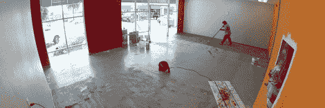

# 通过 3D 打印机商店将黑客空间货币化

> 原文：<https://hackaday.com/2012/09/21/monetizing-a-hackerspace-with-a-3d-printer-store/>

创建一个黑客空间很容易，但维护它却是一件痛苦的事情。你不仅需要支付煤气费、水费和电费，还需要有足够的会员来维持整个运作。Deezmaker 可能有一个解决这个问题的办法:让黑客空间兼做 3D 打印店。

Deezmaker 是在旧金山 Maker Faire 上看到的 [Bukobot 3D 打印机](http://deezmaker.com/bukobot/)的创造者，并在 Kickstarter 上成功资助了[。这家新商店/hackerspace 将向街上的人们出售 Bukobot 3D 打印机(如果另一家公司愿意，也可以出售其他品牌)、细丝、Kapton 胶带、电子零件和其他随机电子用品。](http://www.kickstarter.com/projects/deezmaker/buko-3d-printer-raising-the-bar-of-open-source-3d)

除了 3D 打印机商店，Deezmaker 还将为任何需要打印东西、工作台甚至只是使用一些工具的人运营一个黑客空间。盛大的开幕式将于 9 月 23 日周日在加州帕萨迪纳举行。

我们真的很喜欢商店/黑客空间的想法，因为 Deezmaker 的商店将为任何有类似商业计划的人提供一个极好的案例研究。如果在每个城市都有一个独立的黑客商店，出售从 3D 打印机到电池和 led 的所有东西，那就太好了。是的，这听起来像是回到了 70 年代的 RadioShack，但这并不意味着这个想法在今天不会成功。