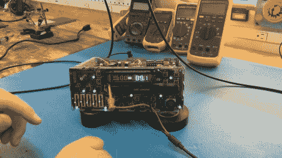

# 修理汽车音响的 VFD 驱动器

> 原文：<https://hackaday.com/2012/09/24/repairing-a-vfd-driver-on-a-car-stereo/>

我们喜欢看到维修，总是惊叹于追踪问题的能力。[托德]似乎有这方面的诀窍。当他试图让他的汽车音响上的真空荧光显示屏工作时，遇到了很多困难。大量的坚持，再加上一点点走捷径，让他完成了自己的目标。

总部在他 1994 年的吉普车里。他知道无线电功能仍然工作，但显示屏完全黑了。把它从仪表板上拿出来后，他把它连接到一个工作台电源上，开始四处探查。他通过将无线电设置为自动扫描模式并用万用表进行测试，确定数据线仍在工作。当他去测量阴极引脚时，他没有得到任何读数。似乎提供那个信号的驱动器被烧坏了。

一个简单的解决办法是更换被清理单元的零件。[Todd]去了垃圾场，从一辆吉普车上捡了一辆，这辆车和他的车只差一个型号。唉，它们并不完全一样，尽管他换出了一个芯片(使用一个干净的加热吸盘)，但它并没有工作。最后，他简单地加入了一个功率电阻器，将 12V 的电压轨用作灯丝的 1V 0.1A 电源。

你可以在休息后的视频中看到他的修复表演。如果你正在寻找清理这些类型的显示器的技巧[，看看这篇文章](http://hackaday.com/2011/07/07/vfd-hacking/)。

[https://www.youtube.com/embed/SfagI3HKtaM?version=3&rel=1&showsearch=0&showinfo=1&iv_load_policy=1&fs=1&hl=en-US&autohide=2&wmode=transparent](https://www.youtube.com/embed/SfagI3HKtaM?version=3&rel=1&showsearch=0&showinfo=1&iv_load_policy=1&fs=1&hl=en-US&autohide=2&wmode=transparent)