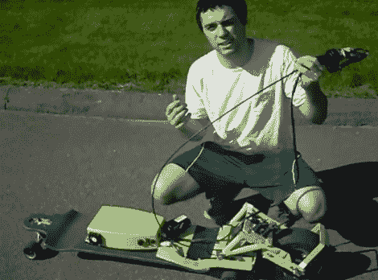

# 以低于 100 美元的价格制造一个电动长板

> 原文：<https://hackaday.com/2012/09/24/building-an-electric-powered-longboard-for-under-100/>

[艾伦]不需要在镇上到处跑，因为他在长板上加了一个可移动的电动马达。它看起来很棒，而且运作良好，因为他没有重新发明轮子。这个想法是一个电动剃须刀滑板车和他的长板的混搭。

这个项目的大部分围绕着将他需要的一切安装到电路板上。谈到驱动轮，他设计了一个张力系统。当骑手不在板上时，长板的后轮离地大约一英寸。悬挂系统中的弹簧使得当你安装冲浪板时，所有的轮子都接触到了，即使在转弯时，主驱动轮也紧紧地贴在路面上。

与某些电动滑板不同的是【Alan】不需要将滑板抬离地面，因为电池盒安装在滑板顶部。他为炎热的夏天增加了冷却风扇，甚至用 velcro 来连接充电器，这样当他离开家时就可以充电了。看看他的三分钟节目，休息后告诉嵌入式。

[https://www.youtube.com/embed/1VNC18JMs3o?version=3&rel=1&showsearch=0&showinfo=1&iv_load_policy=1&fs=1&hl=en-US&autohide=2&wmode=transparent](https://www.youtube.com/embed/1VNC18JMs3o?version=3&rel=1&showsearch=0&showinfo=1&iv_load_policy=1&fs=1&hl=en-US&autohide=2&wmode=transparent)