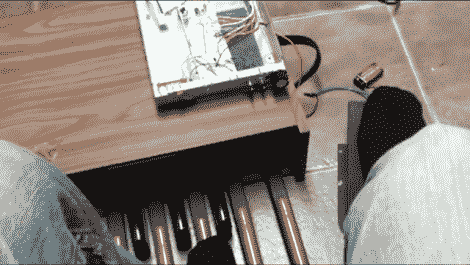

# BaceMaker 将风琴脚踏板与吉他晦气效果结合在一起

> 原文：<https://hackaday.com/2012/09/24/bacemaker-weds-organ-foot-pedals-with-guitar-whammy-effects/>

[Jon Ferwerda]在进行一些电路弯曲实验时，设法在一个旧的电子琴上烧毁了模拟电子设备。这是一个损失，但他仍然留下了一些很酷的设备来玩。最近，他开始用风琴的脚踏板发出音调。

有两种类型的脚踏板包括在这个器官中，一组像键盘一样排列，一个类似于电动缝纫机的摇杆踏板。由于音乐的产生是由那些油炸的器官控制的，乔恩开始用 555 定时器连接脚键盘。他使用了一个相当大的电容器来获得低音范围的频率，并将单个踏板连接到电阻网络的不同部分。但他并没有就此止步。摇杆踏板有自己的可变电阻硬件，可以让他弯曲产生的音高，听起来就像吉他的晦气效果。休息之后，他在视频中展示了自己的作品。我们认为他成功了！这是对任何类型的电子音乐系统的完美补充。

[https://www.youtube.com/embed/-5FpFvh-oQY?version=3&rel=1&showsearch=0&showinfo=1&iv_load_policy=1&fs=1&hl=en-US&autohide=2&wmode=transparent](https://www.youtube.com/embed/-5FpFvh-oQY?version=3&rel=1&showsearch=0&showinfo=1&iv_load_policy=1&fs=1&hl=en-US&autohide=2&wmode=transparent)