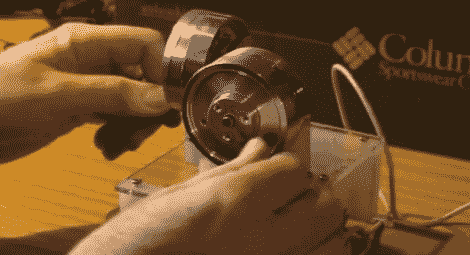

# 平移/倾斜滚轮训练器最终成为一种不同的游戏方式

> 原文：<https://hackaday.com/2012/09/25/pantilt-wheel-trainer-ends-up-being-a-different-way-to-play-quake/>

这是[加里·斯科特] [制造的一个特殊控制器，用来帮助训练摄影师](http://www.youtube.com/watch?v=RynzsWtR0sI)。高端电影摄像机上的平移和倾斜控制使用滚轮来平滑平移和倾斜。这个装置可以相当便宜地建造，并且可以用来练习跟随一个主题，就像你使用照相机一样。这是项目进入熟悉领域的转折点。[Gary]建立一个系统，这样你就可以用这个控制器玩游戏 Quake，剩下的就用你的脚来做了。

平移/倾斜控制器使用旧录像机的两个云台。它们被安装在一只老式球型鼠标的内脏上方。一对橡胶带将头部连接到通常由球旋转的两个鼠标杆上。这让他可以控制雷神之锤游戏的发展方向。但是他仍然需要能够移动，跳跃，更换武器。开枪吧。所以他为自己的脚造了第二个控制器。它使用一张 CD 和一些开关作为操纵杆，一组按钮用于其他控制。他实际上在每一个脚踏开关上安装了螺线管，以物理方式按下键盘上的按键。你真的应该亲眼看看。休息之后我们嵌入了他的视频。

[https://www.youtube.com/embed/RynzsWtR0sI?version=3&rel=1&showsearch=0&showinfo=1&iv_load_policy=1&fs=1&hl=en-US&autohide=2&wmode=transparent](https://www.youtube.com/embed/RynzsWtR0sI?version=3&rel=1&showsearch=0&showinfo=1&iv_load_policy=1&fs=1&hl=en-US&autohide=2&wmode=transparent)

[https://www.youtube.com/embed/BEAfYDZ3CGo?version=3&rel=1&showsearch=0&showinfo=1&iv_load_policy=1&fs=1&hl=en-US&autohide=2&wmode=transparent](https://www.youtube.com/embed/BEAfYDZ3CGo?version=3&rel=1&showsearch=0&showinfo=1&iv_load_policy=1&fs=1&hl=en-US&autohide=2&wmode=transparent)

[https://www.youtube.com/embed/Yfa9QFVISak?version=3&rel=1&showsearch=0&showinfo=1&iv_load_policy=1&fs=1&hl=en-US&autohide=2&wmode=transparent](https://www.youtube.com/embed/Yfa9QFVISak?version=3&rel=1&showsearch=0&showinfo=1&iv_load_policy=1&fs=1&hl=en-US&autohide=2&wmode=transparent)