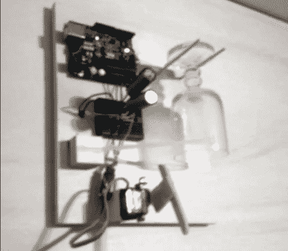

# 水晶门铃有助于提高档次

> 原文：<https://hackaday.com/2012/09/26/crystal-doorbell-helps-class-up-the-joint/>

即使你住在垃圾场，这种快速建造也会让你的门铃听起来很高级。新装备使用水晶高脚杯提醒你门口有客人。我们认为酒杯上的扁平餐具发出的沉默的声音确实能吸引人们的注意力。

对托比亚斯来说，建造过程中最困难的部分是让他的妻子签字同意。但他说，1970 年代的原版看起来相当破旧，这也是他的论点。仅用了两个小时就开发并安装了替代品。它使用一个带有铰接撞针的伺服电机来撞击挂在两个挂钩之间的玻璃。最初的交流变压器(通常为 16V)用于为 Arduino 供电。他建造了一个简单的整流器和一个大的平滑电容器，以确保 Arduino 在电压下降时不会重置。虽然他的评论中没有提到，但我们打赌门铃的电线已经被重新布线，直接连接到 Arduino，而不是一直连接到电源回路。

不要错过休息后的剪辑，听听这东西听起来有多棒。

[https://www.youtube.com/embed/lS-08X75RqU?version=3&rel=1&showsearch=0&showinfo=1&iv_load_policy=1&fs=1&hl=en-US&autohide=2&wmode=transparent](https://www.youtube.com/embed/lS-08X75RqU?version=3&rel=1&showsearch=0&showinfo=1&iv_load_policy=1&fs=1&hl=en-US&autohide=2&wmode=transparent)