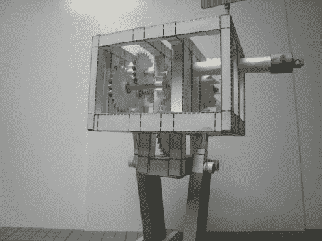

# 惊人的造纸技术造就了这个工作机器人

> 原文：<https://hackaday.com/2012/09/26/astounding-papercraft-skills-result-in-this-working-robot/>

如果我们没有看到所有的部件被制造出来，很难相信这是用纸做的。作为一个静态图像，它看起来很整洁，但视频中那些纸齿轮在休息后转动的速度肯定会让你瞠目结舌。它真的是用 papercraft ( [翻译](http://translate.google.com/translate?sl=auto&tl=en&js=n&prev=_t&hl=en&ie=UTF-8&layout=2&eotf=1&u=http%3A%2F%2Fwww.geocities.jp%2Fkikousya290821%2Fpaperrobot3.htm))制作的行走机器人。

这些实际上是作为套件出售的，但材料方面没有太多。你会得到六张纸，一些作为轴的扦状物，和一点弹力带，当卷起模型时储存势能。天才就在设计中，就印在那些纸上。建造过程涉及大量细致的工作。几十次切割会导致数百次折叠，这还是在组装开始之前。我们从未考虑过在瓶子里造一艘船，但这可能正合我们的胃口。如果你需要送一件礼物给一个修补匠，这应该是你最想送的礼物。

演示机器人

[https://www.youtube.com/embed/R1BgRVUvx0c?version=3&rel=1&showsearch=0&showinfo=1&iv_load_policy=1&fs=1&hl=en-US&autohide=2&wmode=transparent](https://www.youtube.com/embed/R1BgRVUvx0c?version=3&rel=1&showsearch=0&showinfo=1&iv_load_policy=1&fs=1&hl=en-US&autohide=2&wmode=transparent)

组装过程

[https://www.youtube.com/embed/Jx7nS7_Kf7E?version=3&rel=1&showsearch=0&showinfo=1&iv_load_policy=1&fs=1&hl=en-US&autohide=2&wmode=transparent](https://www.youtube.com/embed/Jx7nS7_Kf7E?version=3&rel=1&showsearch=0&showinfo=1&iv_load_policy=1&fs=1&hl=en-US&autohide=2&wmode=transparent)

[通过[使](http://blog.makezine.com/2012/08/28/papercraft-walking-bipedal-robot/)