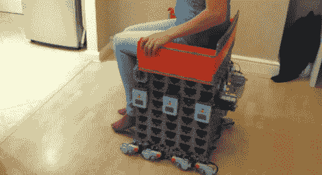

# 由乐高积木制成的电动轮椅

> 原文：<https://hackaday.com/2012/09/26/motorized-wheelchair-built-from-lego-pieces/>

如果使用这个乐高电动轮椅，你肯定不会偷偷靠近任何人。所有这些微型马达发出的尖锐的呜呜声听起来就像一群机器蚊子在吸血。

乐高思维风暴积木中的六块用于驱动马达，第七块作为主控。上面没有画出来，但是右手边有一个操纵杆，可以让驾驶者导航。主砖块监控操纵杆上的四个传感器。然后，它使用一对电机来启动由从属砖块监控的开关。每个从动装置有一个前进开关和一个后退开关，驱动两个电机。为了解决由于转动引起的角速度问题，所有的轮子都是多方向的。

计划是在不久的将来增加蓝牙控制。主/从设置应该相对容易，因为它只影响其中一个模块。这个想法是为了方便机器人控制椅子[，就像我们在其他 Mindstorm 版本](http://hackaday.com/2010/08/02/android-controlling-mindstorms-nxt/)中看到的那样。

不要错过休息后嵌入的演示。

[https://www.youtube.com/embed/yzKxPB6q6-k?version=3&rel=1&showsearch=0&showinfo=1&iv_load_policy=1&fs=1&hl=en-US&autohide=2&wmode=transparent](https://www.youtube.com/embed/yzKxPB6q6-k?version=3&rel=1&showsearch=0&showinfo=1&iv_load_policy=1&fs=1&hl=en-US&autohide=2&wmode=transparent)