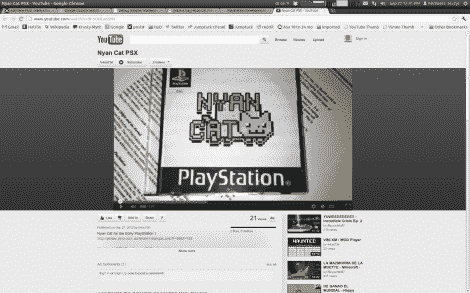

# Nyan 猫:PlayStation 游戏

> 原文：<https://hackaday.com/2012/09/27/nyan-cat-the-playstation-game/>

我们打赌你不知道最初的 PlayStation 有一个 Nyan 猫游戏。嗯，直到最近才有一个。这不是索尼授权的游戏，我们打赌你不会花几个小时玩这样的东西。但是这个概念让[Haunted]磨练了他的开发技能。

我们不确定他是如何绕过 PSX 游戏的版权保护的，但是我们知道有一些不同的漏洞。如果你碰巧有自己玩自制游戏的方法，你甚至可以下载 bin/cue 文件来自己尝试一下。

休息之后，你可以观看游戏的演示片段。它像正常一样启动，直到你碰到一个显示加载百分比的白屏。紧随其后的是彩虹喷猫糕点。声音播放需要一分钟，但你可以肯定它在那里。目前还没有评分系统，但在未来的修订工作。

[https://www.youtube.com/embed/BFoONLwy5Nk?version=3&rel=1&showsearch=0&showinfo=1&iv_load_policy=1&fs=1&hl=en-US&autohide=2&wmode=transparent](https://www.youtube.com/embed/BFoONLwy5Nk?version=3&rel=1&showsearch=0&showinfo=1&iv_load_policy=1&fs=1&hl=en-US&autohide=2&wmode=transparent)