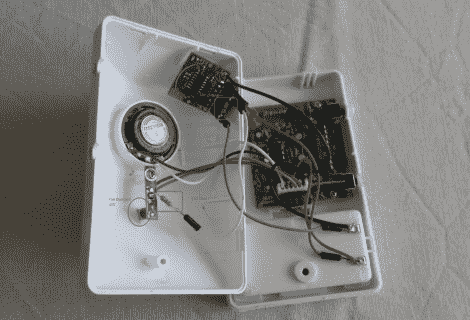

# 互联网桥门铃也适用于其他家庭自动化

> 原文：<https://hackaday.com/2012/09/28/doorbell-to-internet-bridge-also-useful-for-other-home-automation/>

这个无线门铃黑客可以在有人按铃时发送短信。将硬件添加到钟声单元变得非常简单。它显示了在许多其他应用中的潜力。

[Martin]从他为 RFM12B 无线收发器板设计的分线板开始了这个项目。这种板因其低成本、小尺寸和易于操作而广受欢迎。[马丁]的突破比 RFM 模块本身大不了多少，只是在组合中增加了一个 ATtiny84。在这个门铃项目中，他使用 pin 中断来检测门铃的 LED 何时点亮。这会将芯片从睡眠中唤醒，并向接收器发回一条消息，告知发生了一些事情。

接收者可以对这些数据做任何想做的事情。在这种情况下，它使用电子邮件到短信服务向[Martin]发送短信。但是对于这个简单的硬件来说，家庭自动化应用是巨大的。我们有一个不靠近地漏的热水器，所以我们使用一个简单的检漏仪，如果有问题就发出警报(热水器位于一个浅托盘中)。如果我们那时在家，那就行了。使用[马丁的]解决方案可以将警报扩大到全世界。

[via [被黑的小工具](http://hackedgadgets.com/2012/09/03/wireless-doorbell-sends-sms-message-when-activated/)