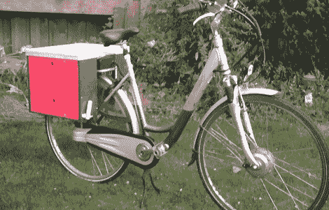

# 在你的自行车架上放置一个工作室

> 原文：<https://hackaday.com/2012/09/30/putting-a-workshop-on-your-bike-rack/>

作为马斯特里赫特修理咖啡馆的一员，[Bertoa]有时需要带一些工具到现场修理机械和电子设备。他以前解决这个问题的方法是在他的汽车后备箱里放一个工具箱，但是他知道他可以想出一个更环保的解决方案。他创造了一个[便携式工作台，正好安装在他的自行车架](http://www.instructables.com/id/How-I-carry-a-workshop-on-the-rear-rack-of-my-bicy/?ALLSTEPS)上，只需要一辆自行车就可以运输小修所需的所有工具。

【Bertoa】的便携式工作台由两部分组成；每侧都有一个小滑动抽屉，非常适合存放螺丝刀和扳手，还有一个倾斜抽屉，可以存放电钻等较重的物品。

工作面将工作台的两侧连接在一起，并能够借助钢琴铰链和几个支架折叠起来。工作台可从自行车架上拆卸下来，并能够依靠其由铝管制成的(可收起的)支腿站立。

尽管便携式工作台仅重约 10 千克，但它能够支撑[Bertoa]的全部体重；对任何制造商的自行车来说都是一个极好的补充，也是在该领域开展项目的一个很好的解决方案。